# Atelier du mardi 19 septembre 2023

## Présent·e·s

- Augustin Braud, IR, IReMus
- Thomas Bottini, IE, IReMus
- Théodora Psychoyou, MCF, IReMus
- Nancy Hachem, docteure, IReMus
- Achille Davy-Rigaux, DR, IReMus
- Suzy Piat, IE, CESR
- Sarra Ferjani, IE, CESR
- Nathalie Berton-Blivet, IR, IReMus
- Yannick Simon, PU, UT2J, université de Toulouse Jean Jaurès
- Marco Gurrieri, IR, IReMus
- Florian Hivert, IE, MSH Val-de-Loire
- Léontine Fortin, IE, CESCM

## Ce que permet le CIDOC-CRM

```
TODO : exprimer ici le modèle de datation du CRM (E2 - P4 - E52 - P81a P81b P82a P82b, et montrer en quoi le fait de ne pas raisonner en moments mais en intervalles dont le début et la fin sont flous est fécond.
```

## Problématiques

### Directions générales

- Toute attribution de date repose sur une interprétation, aussi minime soit-elle, et est donc connectée au graphe par une instance de `crm:E13_Attribute_Assignment`.
- Le standard [ISO 8601](https://fr.wikipedia.org/wiki/ISO_8601) est retenu pour l'expression des dates dans les bases de données.

```mermaid
graph TD;

A(lrmoo::F28_Expression_creation) --> |crm:r17_created| B(lrmoo:F2_expression)
C(crm:E13_Attribute_assignement) --> |crm:p140_assigned_attribute_to| A(lrmoo:F28_Expression_creation)
C(crm:E13_Attribute_assignement) --> |crm:p141_assigned| D(crm:E52_time_span)
C(crm:E13_Attribute_assignement) --> |crm:p14_carried_out_by| G("👩‍🔬")
C(crm:E13_Attribute_assignement) --> |dcterms:created| G("Date ISO 8601")
D(crm:E52_time_span) --> |dcterms:creator| G("👩‍🔬")



C(crm:E13_Attribute_assignement) --> |crm:p177_assigned_property_of_type| E(crm:P4_has_type_span)

D(crm:E52_time_span) --> |crm:p82a_begin_of_the_begin| F("Date ISO 8601")
D(crm:E52_time_span) --> |crm:p81a_end_of_the_begin| H("Date ISO 8601")
D(crm:E52_time_span) --> |crm:p81b_begin_of_the_end| I("Date ISO 8601")
D(crm:E52_time_span) --> |crm:p82b_end_of_the_end| J("Date ISO 8601")





```



### Souplesse dans l'expression des dates vs nécessité informatique d'une date précise

#### Besoins musicologiques

```
TODO : intégrer les exemples de Marco pour faire comprendre cette idée de souplesse requise
```

#### Directions retenues

Si la possibilité d'exprimer le temps de manière souple est importante pour le chercheur en SHS, le fait qu'un événement ne dispose pas de date calculable par la machine (c'est-à-dire exprimable en ISO 8601) l'exclu de fait de toute représentation chronologique calculée des données.
En conséquence, il faudrait que toute date « souple » soit flanquée d'un intervalle défini par deux dates calculables.
Ces dates devraient être définies par le chercheur, car il est le seul à savoir comment doit être raisonablement résolue une approximation comme *« 3ème quart du 4ème siècle »* (350—375 ? Autre chose ?)

### Expression des fourchettes temporelles

### Expression de points de vue multiples

### Expression des dates dans des référentiels calendaires différents

#### Besoins musicologiques

```
TODO : intégrer les exemples de Marco
```

#### Directions retenues

- Le chercheur est estimé spécialiste des calendriers non standards dans lesquels les dates dans ses sources sont exprimées.
- Le chercheur doit saisir ses dates en opérant une conversion en ISO 8601.
- Les systèmes informatiques doivent être délestés de la conversion des dates exprimées selon des calendriers non standards.
- La date constatée sur la source est reportée en annotation.

```
TODO : comment, avec le CRM, mettre en annotation la date constatée sur la source ? On pourrait, avec CRMinf, exprimer que le chercheur constate une date sur une source, puis effectue une opération de conversion impliquant une connaissance du calendrier non standard résultant sur la production d'une nouvelle date. Mais ceci serait bien trop complexe !
```

### Signification des données temporelles absentes
