# Atelier du mardi 19 septembre 2023

## Présent·e·s

- Augustin Braud, IR, IReMus
- Thomas Bottini, IE, IReMus
- Théodora Psychoyou, MCF, IReMus
- Nancy Hachem, docteure, IReMus
- Achille Davy-Rigaux, DR, IReMus
- Suzy Piat, IE, CESR
- Sarra Ferjani, IE, CESR
- Nathalie Berton-Blivet, IR, IReMus
- Yannick Simon, PU, UT2J, université de Toulouse Jean Jaurès
- Marco Gurrieri, IR, IReMus
- Florian Hivert, IE, MSH Val-de-Loire
- Léontine Fortin, IE, CESCM

## Ce que permet le CIDOC-CRM


## Problématiques

### Directions générales

- Toute attribution de date repose sur une interprétation, aussi minime soit-elle, et est donc connectée au graphe par une instance de `crm:E13_Attribute_Assignment`.
- Le standard [ISO 8601](https://fr.wikipedia.org/wiki/ISO_8601) est retenu pour l'expression des dates dans les bases de données.

```mermaid
graph TD;

A(lrmoo::F28_Expression_creation) --> |crm:r17_created| B(lrmoo:F2_expression)
C(crm:E13_Attribute_assignement) --> |crm:p140_assigned_attribute_to| A(lrmoo:F28_Expression_creation)
C(crm:E13_Attribute_assignement) --> |crm:p141_assigned| D(crm:E52_time_span)
C(crm:E13_Attribute_assignement) --> |crm:p177_assigned_property_of_type| E(crm:P4_has_type_span)

C(crm:E13_Attribute_assignement) --> |dcterms:created| F("Date ISO 8601")

C(crm:E13_Attribute_assignement) --> |crm:p14_carried_out_by| G("👩‍🔬")
D(crm:E52_time_span) --> |dcterms:creator| G("👩‍🔬")

D(crm:E52_time_span) --> |crm:p82a_begin_of_the_begin| H("Date ISO 8601")
D(crm:E52_time_span) --> |crm:p81a_end_of_the_begin| I("Date ISO 8601")
D(crm:E52_time_span) --> |crm:p81b_begin_of_the_end| J("Date ISO 8601")
D(crm:E52_time_span) --> |crm:p82b_end_of_the_end| K("Date ISO 8601")
```



### Souplesse dans l'expression des dates vs nécessité informatique d'une date précise

#### Besoins musicologiques

- Marco Gurrieri présente des exemples d'indications temporelles avec incertitudes pouvant être complexes, voire douteux :
  - **Pour un objet :** la datation de _L’Heure espagnole_ de Ravel porte par exemple à confusion. La partition chant et piano a été publiée en 1908 mais l'orchestration réalisée en 1910. La première interprétation de l’opéra a eu lieu en 1911, la même année que la publication de la partition pour orchestre. Ce cas souligne donc la possibilité de multiplier les champs "date".
  - **Pour une personne :** une incertitude se présente pour une personne née la dernière décennie de février 1766, pouvant également être exprimé le 2?/02/1766. Idem pour une date présentant une incertitude plus ou moins toléré, comme un décès survenu le 7 ou 15/12/1654.
  - **Pour une institution :** le terme _circa_ est régulièrement utilisé ; quid de sa désignation scientifique ? Par exemple, une institution fondée circa 1540.
  - **Pour un événement.**    

#### Directions retenues

Si la possibilité d'exprimer le temps de manière souple est importante pour le chercheur en SHS, le fait qu'un événement ne dispose pas de date calculable par la machine (c'est-à-dire exprimable en ISO 8601) l'exclu de fait de toute représentation chronologique calculée des données.
En conséquence, il faudrait que toute date « souple » soit flanquée d'un intervalle défini par deux dates calculables.
Ces dates devraient être définies par le chercheur, car il est le seul à savoir comment doit être raisonablement résolue une approximation comme *« 3ème quart du 4ème siècle »* (350—375 ? Autre chose ?)

### Expression des fourchettes temporelles

### Expression de points de vue multiples

### Expression des dates dans des référentiels calendaires différents

#### Besoins musicologiques

- Marco Gurrieri présente à nouveau des exemples de référentiels calendaires particuliers, requérant une attention toute particulière:
  - **Moyen Âge/Renaissance :**  
    · Calendrier débutant au 1er janvier (style de la Circoncision de Jésus) ;  
    · Calendrier débutant au 1er mars (style vénitien) ;  
    · Calendrier débutant au 25 mars (style florentin ou style de l’Annonciation, typique dans le sud de l’Europe et en Angleterre) ;  
    · Calendrier débutant au 25 décembre (style de la Nativité de Jésus) ;  
    · Calendrier débutant à Pâques (notamment dans certaines régions françaises) ;  
    · En 1564 l’édit de Roussillon signé par Charles IX établit qu’en France l’année commence le 1er janvier.
  - **Révolution française/Première République :**  
    · Calendrier républicain ou révolutionnaire français [officiellement du 1er vendémiaire an I (= 22 septembre 1792) au 22 fructidor an XIII (= 9 septembre 1805), mais entré en vigueur le 15 vendémiaire an II (= 6 octobre 1793).]    
    · Commune de Paris 1871 : calendrier républicain repris à l’an 79 de la République.  
  - **Révolution soviétique :**  
    · Calendrier soviétique débutant à partir du 1er octobre 1929 : l’année comptait 72 segments de cinq jours (360 jours) dont quatre étaient des jours ouvrés, le cinquième un jour de repos. Chaque mois comptait désormais 30 jours, et les cinq ou six jours restants furent ajoutés comme jours intermédiaires de congé, n'appartenant à aucun mois et à aucune semaine. Ces jours étaient :  
        · Le jour de Lénine, après le 30 janvier ;  
        · Deux jours du travail, après le 30 avril ;  
        · Deux jours de l'industrie, après le 7 novembre ;  
        · Un jour supplémentaire, après le 30 février (les années bissextiles).  

#### Directions retenues

- Le chercheur est estimé spécialiste des calendriers non standards dans lesquels les dates dans ses sources sont exprimées.
- Le chercheur doit saisir ses dates en opérant une conversion en ISO 8601.
- Les systèmes informatiques doivent être délestés de la conversion des dates exprimées selon des calendriers non standards.
- La date constatée sur la source est reportée en annotation.

```
TODO : comment, avec le CRM, mettre en annotation la date constatée sur la source ? On pourrait, avec CRMinf, exprimer que le chercheur constate une date sur une source, puis effectue une opération de conversion impliquant une connaissance du calendrier non standard résultant sur la production d'une nouvelle date. Mais ceci serait bien trop complexe !
```

### Signification des données temporelles absentes
