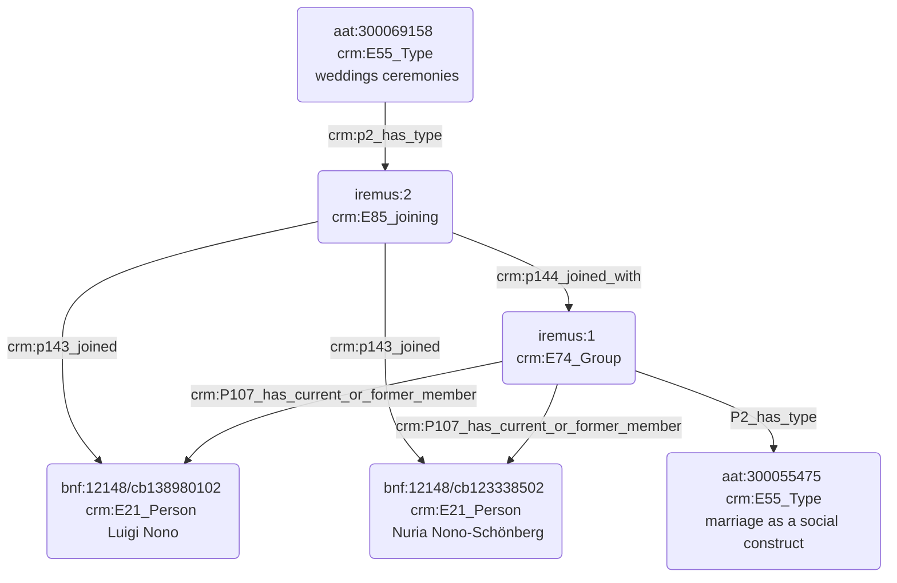

Bonjour ! 

```mermaid
graph

A(iremus:2
<br>crm:E85_joining) --> |crm:p143_joined| B(bnf:12148/cb138980102
<br>crm:E21_Person
<br>Luigi Nono) 
A(iremus:2
<br>crm:E85_joining) --> |crm:p143_joined| C(bnf:12148/cb123338502
<br>crm:E21_Person<br>
Nuria Nono-Schönberg)
E(aat:300069158
<br>crm:E55_Type<br>
weddings ceremonies) --> |crm:p2_has_type| A(iremus:2
<br>crm:E85_joining)
A(iremus:2
<br>crm:E85_joining) --> |crm:p144_joined_with| F(iremus:1
<br>crm:E74_Group)
F(iremus:1
<br>crm:E74_Group) --> |crm:P107_has_current_or_former_member| B(bnf:12148/cb138980102
<br>crm:E21_Person
<br>Luigi Nono)
F(iremus:1
<br>crm:E74_Group) --> |crm:P107_has_current_or_former_member| C(bnf:12148/cb123338502
<br>crm:E21_Person<br>
Nuria Nono-Schönberg)
F(iremus:1
<br>crm:E74_Group) --> |P2_has_type| G(aat:300055475
<br>crm:E55_Type<br>marriage as a social construct)


```
