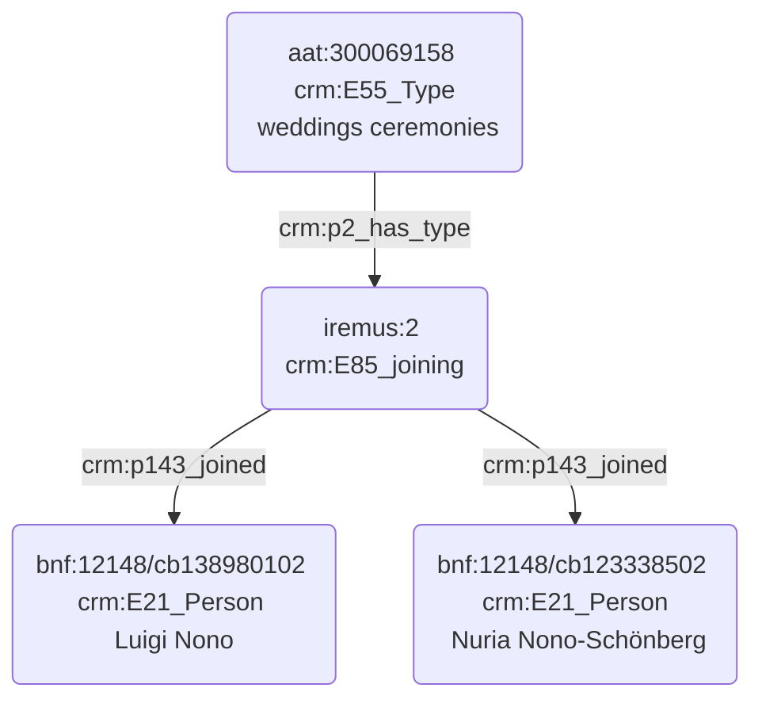

Bonjour ! 

```mermaid
graph

A(iremus:2
<br>crm:E85_joining) --> |crm:p143_joined| B(bnf:12148/cb138980102
<br>crm:E21_Person
<br>Luigi Nono) 
A(iremus:2
<br>crm:E85_joining) --> |crm:p143_joined| C(bnf:12148/cb123338502
<br>crm:E21_Person<br>
Nuria Nono-Schönberg)
E(aat:300069158
<br>crm:E55_Type<br>
weddings ceremonies) --> |crm:p2_has_type| A(iremus:2
<br>crm:E85_joining)
```
