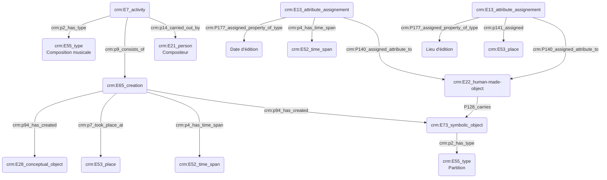

**Consortium Musica2, GT2**
Atelier du jeudi 12/10/2023 : Indexation conceptuelle et _Thesaurii_

Théodora Psychoyou, MCF Sorbonne et directrice de l'IReMus
Thomas Bottini, IE IReMus
Augustin Braud, IR IReMus / Musica2
Guillaume Pélerin, IRCAM
Louis Moreau-Gaudry
Lucia Pasini
Joann Élart, PR Rouen
Jean-François Goudesenne

**Introduction**

- Objectif de la journée : imaginer le référentiel du futur, tout en étant conscient de l’utilisation des existants
- Expliciter les termes de thesaurus et référentiel :
    - Thesaurus : structure interne de mots et concepts mais pas de choses
    - Référentiel : système d’organisation de la connaissance (ou base de données), caractérisé par sa valeur d’usage et désir d’usage. N’est référentiel qu’un système où le désir d’usage est prouvé.

**1er temps ; qu’est-ce qui constitue l’acte d'indexer ?** (Sémiotique)

Donnons la parole aux présents :

- Aborder le geste d’indexation en tant que lui-même 
- L’indexation descriptive vs. Indexation thématique (association) —> comment ?
- L’indexation conceptuelle ou lexicale / lieu —> quoi ?
- Y-a-t’il une indexation de métadonnées ; quel statut donne-t-on à la valeur ? Il ne s’agit pas d’une caractérisation de la forme musicale ? 
- Quels sont les enjeux scientifiques ?

**2e temps ; comment indexe-t-on ?** (Technique et méthodologique)

Donnons la parole aux présents :
(On ne parlera que des systèmes d’organisation de la connaissance et pas des bases de données)

- Quand apparait la nécessité d’indexer ?
- Nécessité d’établir un vocabulaire contrôlé
- Insuffisance des ressources existantes, ou méconnaissance : création d’un référentiel

Il serait bon de :
- Noter les différences dans les pratiques d’indexation selon les périodes, etc.
- Faire un inventaire des référentiels utiles : liste des référentiels existants et méthodologie pour les lister.

**Tentative de graph ; indexation de concepts :**

P128_carries lien entre deux objets

- - - 

Prise de notes Augustin :

12/10/2023

Présents : 
Thomas Bottini, IE IReMus
Augustin Braud, IR Musica2 / IReMus
Théodora Psychoyou, MCF Sorbonne Université, Directrice de l'IReMus
Nancy Hachem, Docteure en Musicologie
Nathalie Berthon-Blivet, IR IReMus 
Marco Gurrieri, IR IReMus
Jean-François Goudesenne, CR IRHT 
Lucia Pasini, Post-doctorante Bern University of Applied Sciences
Achille Davy-Rigaux, DR IReMus
Joann Elart, MCF Université de Rouen
Michela Berti, IR PerformArt 
Louis Moreau-Gaudry, Ingénieur en éducation numérique, Philharmonie de Paris

**Désambiguïsation**

Afin de lever le voile sur l'ambiguïté de certains termes au sein du thesaurus, la présence de musicologues responsables de corpus est nécessaire bien qu'il s'agisse d'une activité chronophage par nature. On peut ensuite l'exploiter scientifiquement avec confiance.

La question des langues est également importante ; nous proposons d'annoter les références plus en détail en précisant la langue utilisée afin de pallier au manque implicite de connaissances des systèmes.

En ce qui concerne les personnes, il semble juste d'ajouter son ISNI à chaque personne citée, afin d'éviter les problématiques liées aux différentes orthographes.

- -

Thomas : Polyphonia avec Marco : dvlpt outil Tonalities 
Corpus de partions en MEI repris et possédant des méta-données 
—> fichier MEI est une source établie en regardant une autre source
Cas « Josquin », seul Marco sait qui est vraiment Josquin avec l’ortographe qu’il a choisi 

Grosse question de désambiguisation / cf ce que dit Théo envers les catalogues 

Différences linguistiques soulevées par Goudesenne ; pb de connaissances implicites liées au système : une bonne pratique pourrait être d’annoter avec la langue 
Joann expé Dezède : mise en place d’un système qui associe un ISNI à chaque personne (exemple Tchaikovsky) ; travail manuel et imposé à la communauté, les utilisateurs doivent le chercher eux-mêmes, ils ne sont pas tous à la BnF former une communauté sur une pratique facile à effectuer et permet une plus grande facilité de travail à partir du moment où l’habitude est adoptée
Sur wiki FR pas d’ISNI, alors que sur wiki EN il existe

L’ajout d’un ISNI est indispensable + localisation des toponymes (lieu)
Joann : https://dezede.hypotheses.org/1045 
L‘indexation est un cadre méthodologique

1er temps ; qu’est-ce qui constitue l’acte d'indexer ?

Nathalie Mercure : 

Tous les airs, objectif d’écrire la musique à travers des éléments très factuels (compositeur librettiste) et des éléments musicaux (tonalités forme etc) (décrit, caractère très empirique)
Corpus de textes : indexer les personnes, les lieux, les mots-clés, thématiques : chaque texte est indexé par une personne et livre l’analyse d’une personne (analysé par une personne)
Nancy parle de l’aspect d’indexer pour défricher un terrain (soit organiser une grande quantité d’infos)
Lucia a hérité d’une BDD mise en place depuis 20 ans ; pb de saisie de données car tout a changé au fur et à mesure des années : d’abord désambiguisation puis standardisation
Question de l’alignement des deux modèles et tensions en résultant
Travail d’indexation = abstraction / modélisation (Théo) ? Extraction de caractéristiques, mises en évidence par la rencontre de deux bases de données ;
Nathalie : circulation au sein du corpus-même, réseau des index et des textes au sein du corpus-même, renvois internes

Théo : pour chaque oeuvre il y a une liste de données indexables qui correspond à du factuel descriptible par source ; également des choses liées à la notice, la conservation, à l’exemplaire exact, etc
Cartographie conceptuelle du corpus avec mots-clés, mots-matières, concepts n’apparaissant pas tels quels dans la source, sujet à un gros travail analytique 
Thesaurus très générique mais avec un pan organologique isolé 
Nécéssité de contrôler pour des corpus de 500 à 2000 sources, si c’est beaucoup plus ça devient beaucoup plus compliqué / travail d’identification car les noms cités ne sont pas toujours cités (exemple : le Duc, le Marquis, ça change tous les 5 ans donc compliqué de trouver qui est qui)
Nécéssité d’offrir un outil cumulatif où tout le monde peut consulter les ressources précédentes 

Thesaurii : 

Quelle différence entre mots-clés / mots-matières et concepts ? 

Polysémie, fait que deux auteurs utilisent des termes similaires pour deux choses très différentes (par exemple « cadence », le contexte permet de déterminer le sens) ; le mot n’est jamais univoque, c’est une image. L’écriture scientifique est une « anti-littérature ».

Michela ; liberté de chercheur est problématique car il y a un souci pour l’indexation, politique qui limite la liberté de chaque personne et donne un niveau de recherche et de précision cohérente ; sans cette politique ça aurait été chaotique. Plusieurs thesaurii pour un meme mot ou bien plusieurs définitions ?

Pb des thesaurii ; ne montrent pas les aspects génétiques et diachroniques donc pb ?
Un enjeu pour les thésaurii est de les publier avec les usages leur correspondant

JFG : pb d’un non-correspondance entre des mots et des concepts, par exemple partition qui ne correspond pas au concept, pb d’attribution : l’historiographie continue à parler d’un ancien nom alors que l’on a trouvé récemment que ce n’était pas lui / pb de la tradition orale
Provenance - usage - origine ; pour les informations de localisation
Un des risques pouvant peser sur les jeunes musicologues pourrait être l’anachronisme en utilisant des outils récents pour commenter le passé.
Être sensible aux variations et effectuer une cartographie de la transmission, cf la diffusion d’une oeuvre par exemple / exemple des chantres vs compositeurs / E13 partout

Faire le point sur les termes : 

Vocabulaire contrôlé : arrive dès que l’utilisateur ne peut pas saisir npq mais a le choix entre des termes définis au sein de l’outil (cf exemple des en-têtes MEI) 
Pas de sens de constituer le thesaurus avant de mettre le nez dans les sources « couteau affuté au fur et à mesure de son usage » / parallélisme tempéré par l’expérience de la recherche

Thesaurus : aspect arborescent / un terme peut avoir plusieurs parents et apparaître à différents endroits, un noeud peut avoir plusieurs parents. Termes et ou concepts, possibilité de dire quels sont tous les termes et leurs variantes. 
On y trouve soit des mots, soit des concepts
Chose ou empreinte ? St Augustin

Ontologie permet de se doter d’une définition formelle des concepts ; « qu’est ce qui est irréductible à la teneur conceptuelle de ce qui fait l’homme ? »
Décrire / être à l’intérieur de : analyse ontologique, perception de la teneur des choses
Fixation de la représentation commune de quelque chose / modélisation schématisation abstraction du produit de sa lecture

Base de données peut ne pas être rangée, rassemblement de données sans supposer le fait qu’elles soient écrites, etc. 

Référentiel doit être reconnu par suffisamment de personnes pour attester de son statut de référence ; question de confiance à l’institution qui la porte, question des alignements.
Pour un même objet on peut avoir plusieurs référentiels qui ne correspondent pas forcément : Cassini, Geonames, Google / savoir lequel choisir est difficile.

Expression du doute est fondamentale dans notre travail

Quels référentiels ?

Un bon référentiel a été expertisé par un ingénieur / développeur, la pérennité est nécessaire (plan technique)
CM2 pourrait soutenir Mimo pour les instruments ? ISNI pour les personnes
Il manque un référentiel pour le recueil d’œuvres 
Le référentiel s’impose quand un objet a différentes formes.

Mimo : deux référentiels etc : au-delà du référentiel principal, on relie un second thesaurus qui trie les familles par cordes/percus/claviers, trois niveaux de profondeur / 10/12 langues, sert de point d’entrée pour les musées qui veulent rajouter leur collection dans le catalogue et doivent s’aligner sur le thesaurus de Mimo

Theo ; la subjectivité va jouer sur la profondeur de l’analyse et du détail, il faut accepter de s’arrêter à un moment / penser aux index-matières du RILM 
une partie du périmètre peut être pensée en amont

Thesaurus n’a de sens que pour ce que pour quoi il a été conçu

Livrable conjoint entre GT2 et GTZZ ; personne référence pour faire des pivots et remplissage d’un graphe du consortium en ajoutant des données
Serveur Humanum pour Mimo, lien avec la Philharmonie, facade prouvant que plusieurs jeux de données peuvent être mis en commun conformité nécessaire avec data bnf
Livrable donnant des exemples d’usage des API des référentiels 

Christophe Corbier / Projet Perso : enregistrements grecs sur rouleaux ayant inspiré Ravel etc / question du sonore ? Gestion du corpus, re-documentation et volet analytique, il faut construire un thesaurus qui n’existe pas encore donc difficile. Pas de mise en ligne tant qu’un accord n’est pas trouvé

