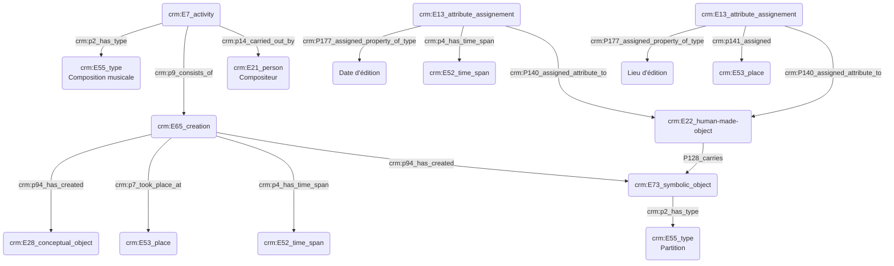

**Consortium Musica2, GT2**
Atelier du jeudi 12/10/2023 : Indexation conceptuelle et _Thesaurii_

Théodora Psychoyou, MCF Sorbonne et directrice de l'IReMus
Thomas Bottini, IE IReMus
Augustin Braud, IR IReMus / Musica2
Guillaume Pélerin, IRCAM
Louis Moreau-Gaudry
Lucia Pasini
Joann Élart, PR Rouen
Jean-François Goudesenne

**Introduction**

- Objectif de la journée : imaginer le référentiel du futur, tout en étant conscient de l’utilisation des existants
- Expliciter les termes de thesaurus et référentiel :
    - Thesaurus : structure interne de mots et concepts mais pas de choses
    - Référentiel : système d’organisation de la connaissance (ou base de données), caractérisé par sa valeur d’usage et désir d’usage. N’est référentiel qu’un système où le désir d’usage est prouvé.

**1er temps ; qu’est-ce qui constitue l’acte d'indexer ?** (Sémiotique)

Donnons la parole aux présents :

- Aborder le geste d’indexation en tant que lui-même 
- L’indexation descriptive vs. Indexation thématique (association) —> comment ?
- L’indexation conceptuelle ou lexicale / lieu —> quoi ?
- Y-a-t’il une indexation de métadonnées ; quel statut donne-t-on à la valeur ? Il ne s’agit pas d’une caractérisation de la forme musicale ? 
- Quels sont les enjeux scientifiques ?

**2e temps ; comment indexe-t-on ?** (Technique et méthodologique)

Donnons la parole aux présents :
(On ne parlera que des systèmes d’organisation de la connaissance et pas des bases de données)

- Quand apparait la nécessité d’indexer ?
- Nécessité d’établir un vocabulaire contrôlé
- Insuffisance des ressources existantes, ou méconnaissance : création d’un référentiel

Il serait bon de :
- Noter les différences dans les pratiques d’indexation selon les périodes, etc.
- Faire un inventaire des référentiels utiles : liste des référentiels existants et méthodologie pour les lister.

**Tentative de graph ; indexation de concepts :**

P128_carries lien entre deux objets

