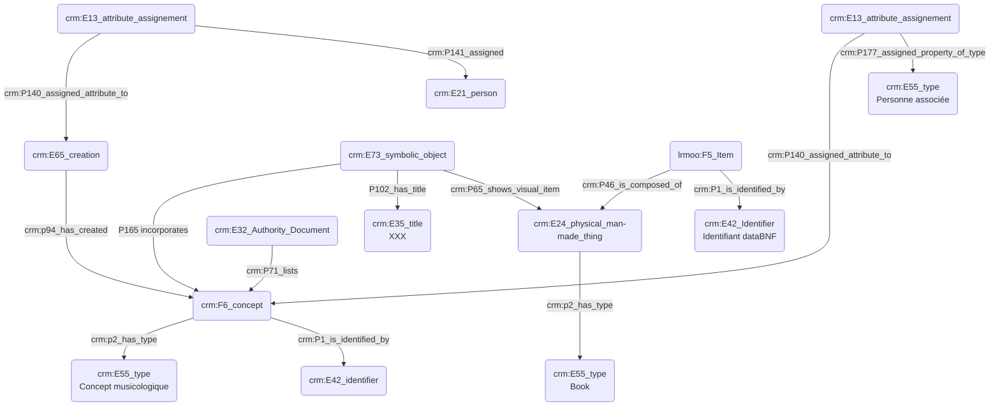

**Concept :**

```mermaid
graph TD;

B(crm:F6_concept) --> |crm:p2_has_type| C(crm:E55_type<br>Concept musicologique)
E(crm:E65_creation) --->|crm:p94_has_created| B(crm:F6_concept)

J(crm:E73_symbolic_object) --->|P165 incorporates| B(crm:F6_concept)
J(crm:E73_symbolic_object) --> |P102_has_title| D(crm:E35_title<br>XXX)
J(crm:E73_symbolic_object) --> |crm:P65_shows_visual_item| K(crm:E24_physical_man-made_thing)
A(lrmoo:F5_Item) --> |crm:P46_is_composed_of| K(crm:E24_physical_man-made_thing)

B(crm:F6_concept) -->|crm:P1_is_identified_by| I(crm:E42_identifier)
H(crm:E32_Authority_Document)  --> |crm:P71_lists| B(crm:F6_concept)

F(crm:E13_attribute_assignement) ---> |crm:P140_assigned_attribute_to| E(crm:E65_creation)
F(crm:E13_attribute_assignement) --> |crm:P141_assigned| G(crm:E21_person)


A(lrmoo:F5_Item) --> |crm:P1_is_identified_by| L(crm:E42_Identifier<br>Identifiant dataBNF)
K(crm:E24_physical_man-made_thing) ---> |crm:p2_has_type| M(crm:E55_type<br>Book)


N(crm:E13_attribute_assignement) -----> |crm:P140_assigned_attribute_to| B(crm:F6_concept)
N(crm:E13_attribute_assignement) -->|crm:P177_assigned_property_of_type| O(crm:E55_type<br>Personne associée)


```

