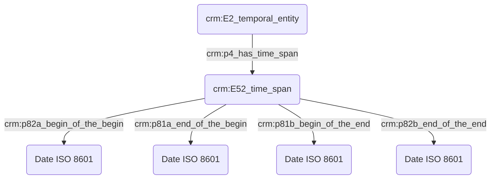
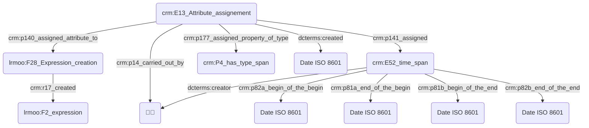

# Livrables GT2

## Introduction 

Dans le cadre du Consortium Musica2, le groupe de travail n°2 "Ontologies et thésaurii" a souhaité instaurer une dynamique collective durant l'année 2023-2024 en organisant des ateliers dédiés à différentes problématiques musicologiques traitées au prisme des outils ontologiques. Ces ateliers ont permis de fédérer avec régularité une communauté scientifique nationale autour de questions communes à tout musicologue : expression des dates, _thesaurii_, indexaction conceptuelle, _etc_. De ces points de focus ont rejailli des besoins, des doutes, mais aussi des consensus nous permettant de formaliser des pratiques musicologiques correctes par le croisement d'expériences variées. Nous avons alors fait le choix de présenter ce livrable en axes plus ou moins similaires à ceux de nos ateliers, tout en gardant à l'esprit l'aspect _work-in-progress_ d'un tel travail. 

Bien que nous abordions diverses ontologies durant ces ateliers, telles LRMoo ou bien DoRéMus, une extension du modèle FRBRoo permettant la description étendue de catalogue musicaux, celles-ci sont toutes issues du socle Cidoc-CRM. Du fait de l'universalité de ses objets et de l'expressivité avec lesquels elle les définit, cette ontologie est particulièrement adaptée aux sciences humaines. Les concepts et les relations implicites et explicites peuvent être modélisées de manière variées pour s'approcher au plus du sens réel que l'utilisateur souhaite y instiller. Un besoin primordial émerge alors rapidement de l'assemblée : développer une meilleure connaissance et compréhension des outils de modélisation conceptuelle. En effet, bien que la grande majorité des chercheur·euse·s soit familière avec les bases de données, l'étape de modélisation des données est la plupart du temps négligée et fait ainsi face aux écueils suivants :
- faire l'impasse sur un terreau de connaissances existantes
- un manque de clarté dans la relations sémantiques entre les données
- l'impossibilité d'alignement avec d'autres systèmes 

Ces ateliers ont malgré tout démontré la nécessité de l'usage d'outils ontologiques dans la bonne gestion de certaines métadonnées et l'interopérabilité qu'elles offrent dans le cadre de projets de recherche à toutes échelles. Certains modules nécéssitent malgré tout une attention toute particulière et furent abordés en détail dans des ateliers éponymes, afin de poser le fondations sur lesquelles notre groupe de travail fournira des recommandations de bonnes pratiques. Ce document abordera dans un premier temps des questions liées à la **datation** et plus particulièrement à l'adéquation recherchée entre la nécessité informatique d'une date précise et la souplesse nécessaire à la juste transmission de l'information scientifique. Faisant logiquement suite à ces problématiques, nous nous questionnerons sur les enjeux soulevés lors d'un travail de **prosopographie**, s'intéressant aux dates et lieux mais aussi aux personnes et institutions, ajoutant ainsi un niveau supplémentaire de complexité à notre travail de modélisation. Après avoir abordé ces points, nous pourrons nous consacrer à l'**indexation conceptuelle** et l'usage des _thesaurii_, nous permettant à nouveau d'aborder un champ d'abstraction supplémentaire dans notre travail de modélisation. 

Nous avons également souhaité valoriser les ressources du Consortium Musica2 à travers deux ateliers démontrant l'intérêt du croisement d'outils ontologiques avec d'autres approches. Nous avons ainsi collaboré avec le GT1 "MEI" pour un atelier dédié à la question des métadonnées MEI dans divers projets éditoriaux, et pourrons ainsi aborder le croisement des outils issus de la MEI et du Cidoc-CRM dans le travail sur les **éditions critiques**. Bien que les cas abordés se focalisent majoritairement sur des périodes allant de la musique ancienne au Romantisme, nous avons souhaité collaborer avec le GT4 "Numérisation et archivage des musiques contemporaines" afin de réfléchir aux possibilités de **modélisation ontologique pour le répertoire contemporain**. Le large scope abordé par ces thématiques transversales vient compléter les modules fondamentaux et nourrit une réflexion critique.

Nous envisageons en effet de laisser cette archive GitHub ouverte et la mettre à jour de manière régulière, en conséquence de nos réfléxions tout autant que d'avancées dans les solutions de modélisation.

**

## 1. Datation : 
### a. Besoins musicologiques

Les besoins variés du chercheur en sciences humaines pour la définition du temps et de ses implications ont été clairement soulignés lors de l'atelier _datation_. Ceux-ci peuvent être exprimés comme suit :

- Pouvoir exprimer le temps de manière souple
- Rendre compte d'un doute 
- S'inscrire dans un champ temporel informatiquement normé et compréhensible

### b. Problématisation 


En conséquence, il faudrait que toute date « souple » soit flanquée d'un intervalle défini par deux dates calculables. Ces dates devraient pouvoir être définies par le chercheur, car il est le seul à savoir comment doit être raisonablement résolue une approximation comme « 3ème quart du 4ème siècle » (350—375 ? Autre chose ?). Les intervalles peuvent alors être définis de quatre manières principales :
### c. Contextualisation technique

 Une première étape vers cette interopérabilité est la conversion obligatoire de toute date - y compris celles exprimées au sein de calendriers anciens - au format ISO 8601.

#### Directions générales

- Toute attribution de date repose sur une interprétation, aussi minime soit-elle, et est donc connectée au graphe par une instance de `crm:E13_Attribute_Assignment`.
- Le standard [ISO 8601](https://fr.wikipedia.org/wiki/ISO_8601) est retenu pour l'expression des dates dans les bases de données.


#### Souplesse dans l'expression des dates vs nécessité informatique d'une date précise

##### Besoins musicologiques

- Marco Gurrieri présente des exemples d'indications temporelles avec incertitudes pouvant être complexes, voire douteux :
  - **Pour un objet :** la datation de _L’Heure espagnole_ de Ravel porte par exemple à confusion. La partition chant et piano a été publiée en 1908 mais l'orchestration réalisée en 1910. La première interprétation de l’opéra a eu lieu en 1911, la même année que la publication de la partition pour orchestre. Ce cas souligne donc la possibilité de multiplier les champs "date".
  - **Pour une personne :** une incertitude se présente pour une personne née la dernière décennie de février 1766, pouvant également être exprimé le 2?/02/1766. Idem pour une date présentant une incertitude plus ou moins toléré, comme un décès survenu le 7 ou 15/12/1654. Lors de l'usage du Cidoc CRM, plusieurs instances de E13 viendront justifier les choix de datation.
  - **Pour une institution :** le terme _circa_ est régulièrement utilisé ; quid de sa désignation scientifique ? Par exemple, une institution fondée circa 1540.
  - **Pour un événement.**


##### Directions retenues

Si la possibilité d'exprimer le temps de manière souple est importante pour le chercheur en SHS, le fait qu'un événement ne dispose pas de date calculable par la machine (c'est-à-dire exprimable en ISO 8601) l'exclu de fait de toute représentation chronologique calculée des données.
En conséquence, il faudrait que toute date « souple » soit flanquée d'un intervalle défini par deux dates calculables.
Ces dates devraient pouvoir être définies par le chercheur, car il est le seul à savoir comment doit être raisonablement résolue une approximation comme *« 3ème quart du 4ème siècle »* (350—375 ? Autre chose ?). Les intervalles peuvent alors être définis de quatre manières principales : 
 - Strictement contenu dans la période de recherche
 - Couvre la période de recherche
 - Commence avant la période de recherche et se termine en son sein
  - Commence pendant la période de recherche et se termine après

L'atelier a montré que cette pratique consistant à adjoindre à chaque date exprimée par le chercheur en langage naturel une date calculable par la machine était répandue :
  - *« 3ème quart du 4ème siècle »* correspond par défaut pour la machine à la fourchette 350–375.
  - Chez Dezède : la fourchette 1742–1743 correspond à la date calculable premier janvier 1742 – 31 décembre 1743.
  - Chez Ricercar, mars 1742 correspond à la fourchette calculable 1er mars 1742 – 31 mars 1742.
Ces dates n'apparaissent pas dans l'interface, elles sont persistées dans la base de donneés, et ne servent qu'au calcul.

Par ailleurs, une idée avancée durant la séance est que, du moins pour certaines disciplines, les chercheurs peuvent être amenés à favoriser le recours à des fourchettes floues afin de rester prudents si la définition des dates constituent un sujet de friction et de dissensus au sein de la communauté.

#### Expression des fourchettes temporelles

Un cas particulier du besoin de souplesse dans l'expression des dates à des fins scientifiques se manifeste dans les fourchettes temporelles.
Pour exemple, quelle signification concrète doit être donnée au terme *circa* quand il est rencontré ?
Il apparaît que seul le chercheur est en capacité de donner une signification temporelle à cette mention, car c'est lui qui en définitive sait dire, en s'appuyant sur sa connaissance des sources et du contexte, ce qu'il est raisonnable de considérer comme écart possible.

#### Expression de points de vue multiples

Comme évoqué *supra*, donner une date peut engager une prise de risque. Il faut ainsi des mécanismes de recueil des suggestions.

- Le système doit enregistrer chaque date soumise par les chercheurs comme des valeurs signées et datées. Le système ne doit ainsi pas considérer la valeur d'un champ date comme une donnée monolithique, mais comme un succession de contributions contextualisées, un peu à la manière d'un cahier de laboratoire.
- Quand la date n'apparaît pas dans la source, les dates saisies par les chercheurs sont des reconstructions argumentées, ce qui légitime encore davantage le mécanisme exposé juste *supra* qui permet de persister un faisceau d'indices.
- Chaque contribution doit offrir un champ permettant d'exprimer un degré de certitude. Un vocabulaire contrôlé proposant des paliers d'expression de la certitude doit être proposé, et partagé au sein du CM2.

#### Expression des dates dans des référentiels calendaires différents

##### Besoins musicologiques

- Marco Gurrieri présente à nouveau des exemples de référentiels calendaires particuliers, requérant une attention toute particulière:
  - **Moyen Âge/Renaissance :**  
    · Calendrier débutant au 1er janvier (style de la Circoncision de Jésus) ;  
    · Calendrier débutant au 1er mars (style vénitien) ;  
    · Calendrier débutant au 25 mars (style florentin ou style de l’Annonciation, typique dans le sud de l’Europe et en Angleterre) ;  
    · Calendrier débutant au 25 décembre (style de la Nativité de Jésus) ;  
    · Calendrier débutant à Pâques (notamment dans certaines régions françaises) ;  
    · En 1564 l’édit de Roussillon signé par Charles IX établit qu’en France l’année commence le 1er janvier.
  - **Révolution française/Première République :**  
    · Calendrier républicain ou révolutionnaire français [officiellement du 1er vendémiaire an I (= 22 septembre 1792) au 22 fructidor an XIII (= 9 septembre 1805), mais entré en vigueur le 15 vendémiaire an II (= 6 octobre 1793).]    
    · Commune de Paris 1871 : calendrier républicain repris à l’an 79 de la République.  
  - **Révolution soviétique :**  
    · Calendrier soviétique débutant à partir du 1er octobre 1929 : l’année comptait 72 segments de cinq jours (360 jours) dont quatre étaient des jours ouvrés, le cinquième un jour de repos. Chaque mois comptait désormais 30 jours, et les cinq ou six jours restants furent ajoutés comme jours intermédiaires de congé, n'appartenant à aucun mois et à aucune semaine. Ces jours étaient :  
        · Le jour de Lénine, après le 30 janvier ;  
        · Deux jours du travail, après le 30 avril ;  
        · Deux jours de l'industrie, après le 7 novembre ;  
        · Un jour supplémentaire, après le 30 février (les années bissextiles).

##### Directions retenues

- Le chercheur est estimé spécialiste des calendriers non standards dans lesquels les dates dans ses sources sont exprimées.
- Le chercheur doit saisir ses dates en opérant une conversion en ISO 8601.
- Les systèmes informatiques doivent être délestés de la conversion des dates exprimées selon des calendriers non standards.
- La date constatée sur la source est reportée en annotation.

```
TODO : comment, avec le CRM, mettre en annotation la date constatée sur la source ? On pourrait, avec CRMinf, exprimer que le chercheur constate une date sur une source, puis effectue une opération de conversion impliquant une connaissance du calendrier non standard résultant sur la production d'une nouvelle date. Mais ceci serait bien trop complexe !
```

Attention : le champ permettant d'exprimer une date de manière souple ne doit pas être détourné pour y saisir des dates exprimées dans des référentiels calendaires non standards. En effet, une date comme « 13 fructose an 2 » n'est pas « souple » ou « floue » au sens ou « au XVIe siècle » pourrait l'être, elle est parfaitement définie, et doit être convertie en date calculable du calendrier standard.

#### Signification des données temporelles absentes

- Lorsqu'une date est absente d'un document, il est nécessaire de justifier ce vide. Lors de l'usage du Cidoc CRM, une instance de E13 permet d'expliciter la réflexion ayant mené à cette décision.

#### Ergonomie de la recherche

- Les interfaces de recherche par critère temporel doivent proposer une recherche par fourchette dont les bornes sont fixées par l'utilisateur.
- Lors d'une recherche par fourchette temporelle, plusieurs modalités d'interaction entre la fourchette de recherche (FR) et les intervalles temporels des données fouillées doivent être proposées dans l'interface. La logique temporelle d'Allen nous fournit un vocabulaire utile :


(source : https://www.researchgate.net/figure/Les-relations-dAllen-entre-deux-intervalles-temporels_fig9_309419339)

- À terme, l'utilisation d'un référentiel de périodes normées pourrait être utile. _Periodo_ est notamment cité (source: https://client.perio.do/?page=backend-home&backendID=web-https://data.perio.do/)
- L'utilisateur doit pouvoir élargir aisément les bornes de sa requête de recherche temporelle afin de sonder comment la cardinalité des résultats de recherche est affectée. Une recherche peut s'effectuer en deux coups : d'abord ramener un grand ensemble de résultat fortement bruité, puis ajuster la fourchette temporelle pour affiner les résultats.


#### d. Proposition Cidoc-CRM


### Ce que permet le CIDOC-CRM





**Dates**
Directions retenues


**


: a) bout de graphe qui illustre la proposition b) alternatives CRM commentées c) identifier les limitations, les problèmes potentiels

· Faire des liens entre les cas 

## 2. Prosopographie : 
### a. Besoins musicologiques

### b. Problématisation 

### c. Contextualisation technique

### d. Proposition Cidoc-CRM


## 3. Indexation conceptuelle et thesaurii : 
### a. Besoins musicologiques

### b. Problématisation 

### c. Contextualisation technique

### d. Proposition Cidoc-CRM


## 4. Éditions critiques : 
### a. Besoins musicologiques

### b. Problématisation 

### c. Contextualisation technique

### d. Proposition Cidoc-CRM


## 5. Modélisation ontologique pour le répertoire contemporain : 
### a. Besoins musicologiques

### b. Problématisation 

### c. Contextualisation technique

### d. Proposition Cidoc-CRM
