```mermaid
graph TD;

B(E7_activity) -->|crm:P14_carried_out_by| A("crm:E21_Person<br>Personne 1 👩🏼")
B(E7_activity) -->|crm:P2_has_type| C(E55_type<br>Fréquentation)

B(E7_activity) -->|crm:P7_took_place_at| I(E53_place)

B(E7_activity) --> |crm:p4_has_time_span| D(crm:E52_time_span)
D(crm:E52_time_span) --> |crm:p82a_begin_of_the_begin| E("Date ISO 8601")
D(crm:E52_time_span) --> |crm:p81a_end_of_the_begin| F("Date ISO 8601")
D(crm:E52_time_span) --> |crm:p81b_begin_of_the_end|G("Date ISO 8601")
D(crm:E52_time_span) --> |crm:p82b_end_of_the_end| H("Date ISO 8601")
```

```mermaid
graph TD;

K(socE_relationship/socE_social_bond) --->|P7_took_place_at| I(E53_place)

K(socE_relationship/socE_social_bond) --> |crm:p4_has_time_span| D(crm:E52_time_span)
D(crm:E52_time_span) --> |crm:p82a_begin_of_the_begin| E("Date ISO 8601")
D(crm:E52_time_span) --> |crm:p81a_end_of_the_begin| F("Date ISO 8601")
D(crm:E52_time_span) --> |crm:p81b_begin_of_the_end|G("Date ISO 8601")
D(crm:E52_time_span) --> |crm:p82b_end_of_the_end| H("Date ISO 8601")

K(socE_relationship/socE_social_bond) --->|socP_binds| A("crm:E21_Person<br>Personne 1 👩🏼")
K(socE_relationship/socE_social_bond) --->|socP_binds| J("crm:E21_Person<br>Personne 2 🧔🏻‍♂️")

```

# Livrables GT2

## Introduction 

Dans le cadre du Consortium Musica2, le groupe de travail n°2 "Ontologies et thésaurii" a souhaité instaurer une dynamique collective durant l'année 2023-2024 en organisant des ateliers dédiés à différentes problématiques musicologiques traitées au prisme des outils ontologiques. Ces ateliers ont permis de fédérer avec régularité une communauté scientifique nationale autour de questions communes à tout musicologue : expression des dates, _thesaurii_, indexaction conceptuelle, _etc_. De ces points de focus ont rejailli des besoins, des doutes, mais aussi des consensus nous permettant de formaliser des pratiques musicologiques correctes par le croisement d'expériences variées. Nous avons alors fait le choix de présenter ce livrable en axes plus ou moins similaires à ceux de nos ateliers, tout en gardant à l'esprit l'aspect _work-in-progress_ d'un tel travail. 

Bien que nous abordions diverses ontologies durant ces ateliers, telles LRMoo ou bien DoRéMus, une extension du modèle FRBRoo permettant la description étendue de catalogue musicaux, celles-ci sont toutes issues du socle Cidoc-CRM. Du fait de l'universalité de ses objets et de l'expressivité avec lesquels elle les définit, cette ontologie est particulièrement adaptée aux sciences humaines. Les concepts et les relations implicites et explicites peuvent être modélisées de manière variées pour s'approcher au plus du sens réel que l'utilisateur souhaite y instiller. Un besoin primordial émerge alors rapidement de l'assemblée : développer une meilleure connaissance et compréhension des outils de modélisation conceptuelle. En effet, bien que la grande majorité des chercheur·euse·s soit familière avec les bases de données, l'étape de modélisation des données est la plupart du temps négligée et fait ainsi face aux écueils suivants :
- faire l'impasse sur un terreau de connaissances existantes
- un manque de clarté dans la relations sémantiques entre les données
- l'impossibilité d'alignement avec d'autres systèmes 

Ces ateliers ont malgré tout démontré la nécessité de l'usage d'outils ontologiques dans la bonne gestion de certaines métadonnées et l'interopérabilité qu'elles offrent dans le cadre de projets de recherche à toutes échelles. Certains modules nécéssitent malgré tout une attention toute particulière et furent abordés en détail dans des ateliers éponymes, afin de poser le fondations sur lesquelles notre groupe de travail fournira des recommandations de bonnes pratiques. Ce document abordera dans un premier temps des questions liées à la **datation** et plus particulièrement à l'adéquation recherchée entre la nécessité informatique d'une date précise et la souplesse nécessaire à la juste transmission de l'information scientifique. Faisant logiquement suite à ces problématiques, nous nous questionnerons sur les enjeux soulevés lors d'un travail de **prosopographie**, s'intéressant aux dates et lieux mais aussi aux personnes et institutions, ajoutant ainsi un niveau supplémentaire de complexité à notre travail de modélisation. Après avoir abordé ces points, nous pourrons nous consacrer à l'**indexation conceptuelle** et l'usage des _thesaurii_, nous permettant à nouveau d'aborder un champ d'abstraction supplémentaire dans notre travail de modélisation. 

Nous avons également souhaité valoriser les ressources du Consortium Musica2 à travers deux ateliers démontrant l'intérêt du croisement d'outils ontologiques avec d'autres approches. Nous avons ainsi collaboré avec le GT1 "MEI" pour un atelier dédié à la question des métadonnées MEI dans divers projets éditoriaux, et pourrons ainsi aborder le croisement des outils issus de la MEI et du Cidoc-CRM dans le travail sur les **éditions critiques**. Bien que les cas abordés se focalisent majoritairement sur des périodes allant de la musique ancienne au Romantisme, nous avons souhaité collaborer avec le GT4 "Numérisation et archivage des musiques contemporaines" afin de réfléchir aux possibilités de **modélisation ontologique pour le répertoire contemporain**. Le large scope abordé par ces thématiques transversales vient compléter les modules fondamentaux et nourrit une réflexion critique.

Nous envisageons en effet de laisser cette archive GitHub ouverte et la mettre à jour de manière régulière, en conséquence de nos réfléxions tout autant que d'avancées dans les solutions de modélisation.

## 1. Datation : 
### a. Besoins musicologiques

Les besoins variés du chercheur en sciences humaines pour la définition du temps et de ses implications ont été clairement soulignés lors de l'atelier _datation_ par la mise en exergue de divers cas particuliers complexes, voire douteux. Par exemple, dans le cas de _L’Heure espagnole_ de Ravel, la partition chant et piano a été publiée en 1908 mais l'orchestration réalisée en 1910. La première interprétation publique de l’opéra a eu lieu en 1911, la même année que la publication de la partition pour orchestre. Ce cas souligne donc la possibilité de multiplier les champs "date" correspondant aux diverses versions de l'œuvre. Le terme _circa_ est par ailleurs régulièrement employé bien qu'il manque de précision à plusieurs égards. 

Les différents référentiels calendaires en usage questionnent également quant à leur lisibilité mais aussi leur alignement avec d'autres normes. Nous pouvons notamment évoquer pour la période s'étirant du Moyen-Âge à la Renaissance des calendriers tels que le style vénitien, débutant au 1er mars, ou encore le style florentin, aussi appelé style de l’Annonciation, débutant au 25 mars. Un peu plus tard, les calendriers de la Première République proposent de nouvelles dénominations et complexifient à nouveau le travail d'alignement du chercheur. Celui-ci est d'autant plus difficile à appréhender qu'il début officiellement le 1er vendémiaire an I (= 22 septembre 1792) au 22 fructidor an XIII (= 9 septembre 1805), mais n'entre en vigueur que le 15 vendémiaire an II (= 6 octobre 1793). Enfin, dans le cadre du calendrier soviétique débutant à partir du 1er octobre 1929, l’année comptait soixante-douze segments de cinq jours (soit trois-cent soixante jours) dont quatre étaient des jours ouvrés, le cinquième un jour de repos. Chaque mois comptait désormais 30 jours, et les cinq ou six jours restants furent ajoutés comme jours intermédiaires de congé, n'appartenant à aucun mois et à aucune semaine. Ces jours étaient : le jour de Lénine, après le 30 janvier, deux jours du travail, après le 30 avril, deux jours de l'industrie, après le 7 novembre et un jour supplémentaire, après le 30 février (les années bissextiles). La complexité et la difficulté d'interopérabilité entre ces différents référentiels calendaires nous oriente vers une volonté d'unification des systèmes pour une meilleure lecture et compréhension des interactions entre différentes dates.

À la lumière de ces exemples, nous pouvons d'ores et déjà définir quelques besoins principaux :
- Pouvoir exprimer le temps de manière souple
- Rendre compte d'un doute 
- S'inscrire dans un champ temporel informatiquement normé et compréhensible

### b. Problématisation 

En conséquence, il faudrait que toute date « souple » soit flanquée d'un intervalle défini par deux dates calculables. Ces dates devraient pouvoir être définies par le chercheur, car il est le seul à savoir comment doit être raisonablement résolue une approximation comme « 3ème quart du 4ème siècle » (350—375 ? Autre chose ?). Les intervalles peuvent alors être définis de quatre manières principales :

Si la possibilité d'exprimer le temps de manière souple est importante pour le chercheur en SHS, le fait qu'un événement ne dispose pas de date calculable par la machine (c'est-à-dire exprimable en ISO 8601) l'exclu de fait de toute représentation chronologique calculée des données.
En conséquence, il faudrait que toute date « souple » soit flanquée d'un intervalle défini par deux dates calculables.
Ces dates devraient pouvoir être définies par le chercheur, car il est le seul à savoir comment doit être raisonablement résolue une approximation comme *« 3ème quart du 4ème siècle »* (350—375 ? Autre chose ?). Les intervalles peuvent alors être définis de quatre manières principales : 
 - Strictement contenu dans la période de recherche
 - Couvre la période de recherche
 - Commence avant la période de recherche et se termine en son sein
 - Commence pendant la période de recherche et se termine après

L'atelier a montré que cette pratique consistant à adjoindre à chaque date exprimée par le chercheur en langage naturel une date calculable par la machine était répandue :
  - *« 3ème quart du 4ème siècle »* correspond par défaut pour la machine à la fourchette 350–375.
  - Chez Dezède : la fourchette 1742–1743 correspond à la date calculable premier janvier 1742 – 31 décembre 1743.
  - Chez Ricercar, mars 1742 correspond à la fourchette calculable 1er mars 1742 – 31 mars 1742.
Ces dates n'apparaissent pas dans l'interface, elles sont persistées dans la base de donneés, et ne servent qu'au calcul.

Par ailleurs, une idée avancée durant la séance est que, du moins pour certaines disciplines, les chercheurs peuvent être amenés à favoriser le recours à des fourchettes floues afin de rester prudents si la définition des dates constituent un sujet de friction et de dissensus au sein de la communauté.

Comme évoqué *supra*, donner une date peut engager une prise de risque. Il faut ainsi des mécanismes de recueil des suggestions.

- Le système doit enregistrer chaque date soumise par les chercheurs comme des valeurs signées et datées. Le système ne doit ainsi pas considérer la valeur d'un champ date comme une donnée monolithique, mais comme un succession de contributions contextualisées, un peu à la manière d'un cahier de laboratoire.
- Quand la date n'apparaît pas dans la source, les dates saisies par les chercheurs sont des reconstructions argumentées, ce qui légitime encore davantage le mécanisme exposé juste *supra* qui permet de persister un faisceau d'indices.
- Chaque contribution doit offrir un champ permettant d'exprimer un degré de certitude. Un vocabulaire contrôlé proposant des paliers d'expression de la certitude doit être proposé, et partagé au sein du CM2.

### c. Contextualisation technique

 Une première étape vers cette interopérabilité est la conversion obligatoire de toute date - y compris celles exprimées au sein de calendriers anciens - au format ISO 8601.

 Un cas particulier du besoin de souplesse dans l'expression des dates à des fins scientifiques se manifeste dans les fourchettes temporelles.
Pour exemple, quelle signification concrète doit être donnée au terme *circa* quand il est rencontré ?
Il apparaît que seul le chercheur est en capacité de donner une signification temporelle à cette mention, car c'est lui qui en définitive sait dire, en s'appuyant sur sa connaissance des sources et du contexte, ce qu'il est raisonnable de considérer comme écart possible.

- Toute attribution de date repose sur une interprétation, aussi minime soit-elle, et est donc connectée au graphe par une instance de `crm:E13_Attribute_Assignment`.
- Le standard [ISO 8601](https://fr.wikipedia.org/wiki/ISO_8601) est retenu pour l'expression des dates dans les bases de données.
- Le chercheur est estimé spécialiste des calendriers non standards dans lesquels les dates dans ses sources sont exprimées.
- Le chercheur doit saisir ses dates en opérant une conversion en ISO 8601.
- Les systèmes informatiques doivent être délestés de la conversion des dates exprimées selon des calendriers non standards.
- La date constatée sur la source est reportée en annotation.

Attention : le champ permettant d'exprimer une date de manière souple ne doit pas être détourné pour y saisir des dates exprimées dans des référentiels calendaires non standards. En effet, une date comme « 13 fructose an 2 » n'est pas « souple » ou « floue » au sens ou « au XVIe siècle » pourrait l'être, elle est parfaitement définie, et doit être convertie en date calculable du calendrier standard.

- Lorsqu'une date est absente d'un document, il est nécessaire de justifier ce vide. Lors de l'usage du Cidoc CRM, une instance de E13 permet d'expliciter la réflexion ayant mené à cette décision.

- Les interfaces de recherche par critère temporel doivent proposer une recherche par fourchette dont les bornes sont fixées par l'utilisateur.
- Lors d'une recherche par fourchette temporelle, plusieurs modalités d'interaction entre la fourchette de recherche (FR) et les intervalles temporels des données fouillées doivent être proposées dans l'interface. La logique temporelle d'Allen nous fournit un vocabulaire utile :


(source : https://www.researchgate.net/figure/Les-relations-dAllen-entre-deux-intervalles-temporels_fig9_309419339)

- À terme, l'utilisation d'un référentiel de périodes normées pourrait être utile. _Periodo_ est notamment cité (source: https://client.perio.do/?page=backend-home&backendID=web-https://data.perio.do/)
- L'utilisateur doit pouvoir élargir aisément les bornes de sa requête de recherche temporelle afin de sonder comment la cardinalité des résultats de recherche est affectée. Une recherche peut s'effectuer en deux coups : d'abord ramener un grand ensemble de résultat fortement bruité, puis ajuster la fourchette temporelle pour affiner les résultats.

#### d. Proposition Cidoc-CRM

  - **Pour une personne :** une incertitude se présente pour une personne née la dernière décennie de février 1766, pouvant également être exprimé le 2?/02/1766. Idem pour une date présentant une incertitude plus ou moins toléré, comme un décès survenu le 7 ou 15/12/1654. Lors de l'usage du Cidoc CRM, plusieurs instances de E13 viendront justifier les choix de datation.


```
TODO : comment, avec le CRM, mettre en annotation la date constatée sur la source ? On pourrait, avec CRMinf, exprimer que le chercheur constate une date sur une source, puis effectue une opération de conversion impliquant une connaissance du calendrier non standard résultant sur la production d'une nouvelle date. Mais ceci serait bien trop complexe !
```

## 2. Prosopographie : 
### a. Besoins musicologiques

L'intérêt d'une base prosopographique dans un projet musicologique est de regrouper une importante quantité de données, revêtant elles-mêmes un rôle de métadonnées dans d'autres projets. La méthodologie à utiliser dépend alors fortement de la question initialement posée ; si celle-ci possède une dimension prosopographique inhérente, comme dans les projets MUSEFREM ou encore Ricercar, le processus sera différent de celui visant à constituer une base de données brutes où l'aspect prosopographique émergera d'une mise en regard de mutiple éléments. 

Le travail sur une telle base est divisé en plusieurs étapes : la récolte des informations entame le travail et ne présente _in fine_ aucun caractère prosopographique. Néanmoins, lors d'un foisonnement et éparpillement des documents, la constitution de données prosopographiques devient un outil de recherche et d'appropriation des corpus et se substitue à la phase 1. Dans des cas moins complexes, l'enjeu prosopographique réel est révélé dans la seconde étape, consistant à étudier les liens tangibles entres personnes et institutions. Les données prosopographiques sont donc les résultats inférés à partir de ce qui a été récolté, des données d'essence relationnelle émanant de l'interprétation et du croisement des métadonnées. La base n'est néanmoins qu'un support, le travail prosopographique étant effectué lors de l'exploitation des données.

La singularité de chaque base est importante (Ricercar contient par exemple des centaines de personnes n'existant nulle part ailleurs) et se révèle par le croisement des sources. La méthodologie prosopographique doit donc être appliquée avec vigilance à l'égard une éventuelle friction avec la question de l'*identification* des personnes et le *recours à des référentiels* de personnes. Nous nous interrogeons plus particulièrement à cet égard sur la distinction à opérer entre les personnes physiques et morales, qui portent des informations fondamentalement différentes. 

À la lumière de ces exemples, nous pouvons d'ores et déjà définir quelques besoins principaux :
- Faire émerger de manière claire la distinction entre personnes réelles et fictives
- Faire apparaître les liens tangibles entre différentes personnes et institutions
- Intégrer les données à un champ spatio-temporel normé et perceptible

### b. Problématisation 

La question de la modélisation des personnes est primordiale ; il convient plus précisément d'examiner les différences d'expression entre personnes fictives et réelles. Dans le cas des personnages fictifs, la fonction prime sur la nature puisqu'un personnage mythologique sera forcément ré-instancié sur le plan scientifique. En dehors de problématiques de modélisation, des rôles sont confiés aux personnages et font autorité sur leur caractère fictif ou non, ce qui détermine ensuite leur usage. Il faut également souligner que la dualité entre fictif et réel peut aussi être appropriée en parlant d'événements. On ne mélange pas contexte fictif et réel, la prosopographie demeure dans un contexte commun.  

Les personnes peuvent également être qualifiées par des statuts ou des rôles : les statuts désignent une position objective occupée en fonction d'une qualification d'un grade, et sont définis par plusieurs caractéristiques objectives qui déterminent socialement la position des individus. Le rôle vient s'ajouter au statut de manière souvent plus informelle et permet de distinguer la place sociale des individus ; dans le cadre d'un travail prosopographique, une personne est rarement désignée par l'intégralité de ses fonctions ; nous tâcherons donc de faire le point sur les meilleurs moyens de désigner une personne selon l'une de ses facettes.

Nous nous intérogeons également sur les différentes moyens de modéliser la notion de propriété, d'appartenance, par exemple dans le cadre d'un objet physique.

### c. Contextualisation technique

Pour répondre à la question Dans le cas de l'usage du Cidoc CRM pour un personnage n'ayant pas existé, on privilégie un E28 objet conceptuel ou E21 personne dont la nature fictive est précisée par un crm:P2_has_type E55/fictif ; il est néanmoins nécessaire de réflechir au choix d'une ontologie permettant une interopérabilité maximale ?  
Dans le cas de la base de données Dezède, les personnes physiques sont distinguées des institutions auxquelles elles appartiennent. Une notice existe par institution, prenant en compte sa chronologie et recensant les personnes y étant affiliées. À chaque personne sont associés plusieurs statuts, compositeur, poète, chanteur, librettiste sans vocabulaire figé. On peut indiquer sur la page d'un individu s'il a des relations familiales ou professionnelles (élève, maître, dédicataire) avec un autre individu (ces relations sont dans un vocabulaire contrôlé).

Hors cet exemple, nous nous intérrogeons sur les possibilités de modélisation des notions de dédicataire, de commandiraire informel et d'hommage en CRM. lorsqu'on indexe une personne, on indexe la personne en qualité de la fonction selon laquelle on la considère (Théodora en tant que directrice de l'IReMus, ou, Théodora en tant que spécialiste des rapports entre musique et sciences aux XVIIe et XVIIIe siècles). Dans le CRM, les rôles sont temporellement assignés et liés de manière intrinsèque à un _time span_ et/ou une _place_ ; le statut n’est donc pas tant inhérent à une personne qu'à une période temporelle. 

Un géomètre :
—> prend part à une activité qui est liée à la géométrie 
—> auteur d’une oeuvre à teneur géométrique 

NH :
Dans les documents juridiques, les personnes sont désignées selon leur métier ou leur titre.

JP : 
Statut/profession.
Rôle/poste/fonction.
Le statut ne détermine pas notre fonction ; nécessité d’exprimer un grand nombre de tâches sans pouvoir attester des activités liées à cette fonction. On est toujours musicologue/penseur de la musique même hors du cadre de notre fonction
Mais comment juste dire que LVB était pédagogue ?

NBB : il ne faut pas mélanger les niveaux, Maître Jean est maître à partir de son diplôme mais aussi appelé (nom d’usage) Maître Jean.

TB : On ne construirait pas un graphe dénotant l'activité pédagogique de LVB (car les données sont lacunaires), mais un E13 signé par un chercheur qui éprouverait le besoin de distribuer l'étiquette "pédagogue". Cet étiquetage pourrait alors être discuté sur le Web.

NH : Question : Suzy, Guillaume, Sarra, avez-vous travaillé sur la prosopographie des chantres de la Renaissance, comment ont été construites les étiquettes (composer, musician singer, master of music) ?

SF : Ces rôles ne sont pas reliés à des événements particuliers, mais attribués à une personne comme parties de son identité. Avons défini une liste fermée des choix des différents rôles.

GA : Synthèse des échanges : on peut associer un rôle à une personne, ou associer un rôle à une personne par le truchement d'un événement indexé en fonction du rôle le plus pertinent.

TB : S'investir dans ```crm:P14.1_in_the_role_of```.

Relations : MG : Caractère symétrique (frère) ou non (maître/élève) de la relation. 

LP : Dans Dezède, si A est élève de B, alors B est maître de A (automatiquement).

JP : Démo de https://dezede.org/individus/falla/. Les fonctions sont collectées en regardant le graphe, et dynamiquement injectée dans le cartouche de présentation de la personne. La démonstration prouve que cet exemple de prosopographie relationnelle prend sens par l'interprétation des données.

Institutions JP : Chef de tel institution de telle date à telle date. Théâtre qui contient deux salles. Théâtre éphèmère. Tout cela fonctionne assez bien dans Dezède. Dans le cas d'une programmation d'une institution dans une autre institution mais dans le cadre de sa propre programmation.

Commanditaires : On se pose la question de la possibilité de modéliser :
- un hommage, une dédicace : l'idée de dédicataire existe dans l’ontologie SDHSS, un projet managé par la même équipe que le CRM-Soc.
- une transcription : aisé à exprimer en Lrm.
- un commanditaire : si lien avec l’institution plus aisé à exprimer qu'un commanditaire _informel_ (par exemple, commande à l'occasion d'un anniversaire, etc). Dans le cadre d'une commande institutionnelle on peut exprimer des données prosopographiques très précises sur un _time-span_ : direction, changement d'adresse, etc.
- Doremus ainsi que l'ébauche de la Péniche Opéra peuvent être de bons référentiels dans ces cas.
 
### d. Proposition Cidoc-CRM 

#### - Quelqu'un a fréquenté un lieu :
  

#### - Quelqu'un a rencontré quelqu'un dans un lieu qu'ils on tous deux fréquentés :
  


#### - Quelqu'un a rencontré quelqu'un par le biais d'une tierce personne au sein d'un même lieu :

```mermaid
graph TD;

B(E7_activity<br>Fréquentation 1&2) ----->|crm:P11_had_participant| A("crm:E21_Person<br>Personne 1 👩🏼")
D(E7_activity<br>Fréquentation 1&3) ----->|crm:P11_had_participant| A("crm:E21_Person<br>Personne 1 👩🏼")
O(E7_activity<br>1 entremet 2 et 3) ----->|crm:P14_carried_out_by| A("crm:E21_Person<br>Personne 1 👩🏼")
B(E7_activity<br>Fréquentation 1&2) ----->|crm:P11_had_participant| C("crm:E21_Person<br>Personne 2 🧔🏻‍♂️")
O(E7_activity<br>1 entremet 2 et 3) ----->|crm:P11_had_participant| C("crm:E21_Person<br>Personne 2 🧔🏻‍♂️")
D(E7_activity<br>Fréquentation 1&3) ----->|crm:P11_had_participant| E("crm:E21_Person<br>Personne 3 👩🏻‍🦰")
O(E7_activity<br>1 entremet 2 et 3) ----->|crm:P11_had_participant| E("crm:E21_Person<br>Personne 3 👩🏻‍🦰")

D(E7_activity<br>Fréquentation 1&3) -->|crm:P7_took_place_at| M(E53_place)
B(E7_activity<br>Fréquentation 1&2) -->|crm:P7_took_place_at| M(E53_place)
O(E7_activity<br>1 entremet 2 et 3) --> |crm:P7_took_place_at| M(E53_place)

B(E7_activity<br>Fréquentation 1&2) --->|crm:P2_has_type| F(E55_type<br>Fréquentation)
D(E7_activity<br>Fréquentation 1&3) --->|crm:P2_has_type| F(E55_type<br>Fréquentation)
O(E7_activity<br>1 entremet 2 et 3) ---> |crm:p2_has_type| P(crm:e55_type<br>entremettage)

B(E7_activity<br>Fréquentation 1&2) ----> |crm:p4_has_time_span| I(crm:E52_time_span)
D(E7_activity<br>Fréquentation 1&3) ----> |crm:p4_has_time_span| N(crm:E52_time_span)

```



## 3. Indexation conceptuelle et thesaurii
### a. Besoins musicologiques

La première nécessité apparaissant au sein de nos corpus est celle de la désambiguisation des termes, en s'assurant de la correspondance exacte de leur sens. Afin de lever le voile sur l'ambiguïté de certains termes au sein d'un _thesaurus_, la présence de musicologues responsables de corpus est nécessaire, bien qu'il s'agisse d'une activité chronophage par nature. On peut ensuite l'exploiter scientifiquement avec confiance, sans négliger le question des langues. Préciser la langue utilisée permet dans un premier temps de pallier au manque implicite de connaissances des systèmes.


Enjeux scientifiques de l'indexation ? Fonctions possibles de l'indexation ?

Durant cette séance d'atelier, nous avons fait émerger un ensemble d'opérations mentales et techniques sur lequel s'appuie le travail scientifique, qui convoquent la notion d'indexation :

- ***Indexer pour décrire.*** La ressource d'indexation revêtent ici le rôle de caractériser la ressource indexée, par exemple à des fins de synthèse ou de représentation synoptique des thématiques d'un corpus.
- ***Indexer pour rendre fouillable.*** Les ressources d'indexation constituent ici des éléments d'interface avec lesquels l'utilisateur peut interagir pour effectuer une recherche au sein des corpus.
- ***Indexer pour défricher un corpus.*** Les ressources d'indexation permettent d'asseoir une progression dans la découverte d'un corpus à l'occasion du premier contact en fournissant une unification de ce qui a déjà été rencontrée (activité synthétique au fil de l'eau).
- ***Indexer pour se repérer.*** Les ressources d'indexation sont des petits cailloux blancs permettant au lecteur-Petit Poucet de ne pas se perdre dans son corpus. Elles constituent des marque-page sémantiques.
- ***Indexer pour analyser.*** Les ressources d'indexation constituent une réserve de concepts analytiques qui, distribués sur les sources, en explicitent le sens. L'activité d'indexation n'est pas qu'une activité de redocumentarisation, elle est également une activité scientifique convoquant des interprétant, un cadre théorique, une méthodologie. Les pratiques d'indexation relevant de cet aspect soulignent la nécessiter de signer les annotations d'indexation produites.
- ***Indexer pour faire des statistiques.*** Ceci est un usage plus spécifique de l'indexation à finalité synthétique.
- ***Indexer pour créer une circulation hypertextuelle à l'intérieur des corpus même.*** Ici, l'indexation se positionne comme pratique éditoriale, la ressource d'indexation jouant le rôle de point de passage d'un document à l'autre.
- ***Constituer des thésaurii/référentiels pour analyser.*** L'activité de conception d'un thésaurus ou d'un référentiel d'entités récurrentes est à considérer comme une pratique scientifique et non seulement documentaire, car le système d'organisation des connaissances qui en résulte est un point de vue sur la teneur des savoirs (conceptuels, lexicaux…) convoqués dans l'analyse des sources, c'est une méta-connaissance.

### b. Problématisation

Faut-il ainsi faire appel à plusieurs _thesaurii_ pour un meme mot ou bien intégrer plusieurs définitions dans un seul _thesaurus_? Les _thesaurii_ possèdent par ailleurs un aspect arborescent ; un terme peut avoir plusieurs parents et apparaître à différents endroits, un noeud peut avoir plusieurs parents, etc... L'expression du doute étant fondamentale dans notre travail, nous avons besoin de E13 pour informer des choix et de leur nature. 

Le principal problème des _thesaurii_ est le fait qu'ils ne soulignent pas clairement les aspects génétiques et diachroniques. Il n'y a en effet pas de sens de constituer un thesaurus avant de mettre le nez dans les sources ; l'assemblée emploi l'expression d'un « couteau affuté au fur et à mesure de son usage », un parallélisme tempéré par l’expérience de la recherche. Un enjeu pour la constitution de futurs _thesaurii_ est leur publication avec les usages leur correspondant, en considérant la possibilité d'une cartographie de la transmission, avec à nouveau l'usage de E13. La tradition orale (acceptation de l'attribution d'une source, _etc_) empêche parfois l'information d'être traitée de la bonne manière et peut même mener jusqu'à l'anachronisme, en utilisant des outils récents pour commenter le passé.

En ce qui concerne les personnes, il semble juste d'ajouter son ISNI à chaque personne citée (comme le fait Dezède, en imposant aux membres de sa communauté d'aller chercher les ISNI, ce qui implique des actions/documents de formation), afin d'éviter les problématiques liées aux différentes orthographes. On peut notamment évoquer l'exemple de Tchaïkovsky et les diverses écritures de son nom. Il faut également souligner la présence de l'ISNI sur Wiki EN, au contraire de Wiki FR.

### c. Contextualisation technique

Retours sur les pratiques

Le cas du Mercure Galant

Deux cas de figure :

1) 

L'indexation doit cibler une liste de données indexables factuellement descriptible pour "défricher un terrain" et organiser une grande quantité d’informations concernant leurs sources :

- les personnes
- les lieux
- les mots-clés & mots-matières
- les thématiques
- informations liées à la notice, la conservation, à l’exemplaire exact, _etc_.

Il est également important de souligner que chaque point est indexé par une personne et que cela doit être explicite ; dans le cas d'usage de l'ontologie Cidoc-CRM, on systématisera l'usage d'un E13. Ces précisions sont tout particulièrement utiles compte-tenu de la circulation au sein du corpus-même de concepts, d'un réseau d'index et des textes dense qui porte de nombreux renvois internes.

Comme abordé en préambule, on observe une vrai nécéssité de contrôler pour des corpus limités ; l'assemblée propose un consensus humainement possible pour un maximum de 2000 sources. Le travail d’identification requiert en effet une véritable expertise. En exemple, les personnes ne sont pas toujours citées par leurs noms et leur identification requiert une identification historiographique fine, par exemple : le Duc, le Marquis, _etc_... Ces titres changent très régulièrement. La nécéssité d’offrir un outil cumulatif où chacun peut consulter les ressources issuees des recherches précédentes est également mentionnée.

Quels outils pour indexer : Nous présentons ici divers référentiels intéressants, ayant été expertisés par un ingénieur et/ou développeur et présentant une pérennité prouvée sur les plans techniques tout autant que scientifiques. 
- ISNI pour les personnes.
- En ce qui concerne les instruments, Mimo semble incontournable et est utilisé par la Philharmonie de Paris.
- Pour les lieux il existe un grand nombre de possibilités : Cassini, Geonames, Google...
- Il est fait état du manque d'un référentiel pour le recueil d’œuvres 

L'assemblée souligne que la part de subjectivité mise en œuvre va jouer sur la profondeur de l’analyse et du détail ; il faut donc accepter de devoir s’arrêter à un moment lors du processus analytique. L‘indexation est définie par le cadre méthodologique dans lequel elle s'inscrit.

Base de données peut ne pas être rangée, rassemblement de données sans supposer le fait qu’elles soient écrites, etc. 

Référentiel doit être reconnu par suffisamment de personnes pour attester de son statut de référence ; question de confiance à l’institution qui la porte, question des alignements.
Pour un même objet on peut avoir plusieurs référentiels qui ne correspondent pas forcément : Cassini, Geonames, Google / savoir lequel choisir est difficile.

Expression du doute est fondamentale dans notre travail

Quels référentiels ?

Un bon référentiel a été expertisé par un ingénieur / développeur, la pérennité est nécessaire (plan technique)
CM2 pourrait soutenir Mimo pour les instruments ? ISNI pour les personnes
Il manque un référentiel pour le recueil d’œuvres 
Le référentiel s’impose quand un objet a différentes formes.

Mimo : deux référentiels etc : au-delà du référentiel principal, on relie un second thesaurus qui trie les familles par cordes/percus/claviers, trois niveaux de profondeur / 10/12 langues, sert de point d’entrée pour les musées qui veulent rajouter leur collection dans le catalogue et doivent s’aligner sur le thesaurus de Mimo

Theo ; la subjectivité va jouer sur la profondeur de l’analyse et du détail, il faut accepter de s’arrêter à un moment / penser aux index-matières du RILM 
une partie du périmètre peut être pensée en amont

Livrable conjoint entre GT2 et GTZZ ; personne référence pour faire des pivots et remplissage d’un graphe du consortium en ajoutant des données
Serveur Humanum pour Mimo, lien avec la Philharmonie, facade prouvant que plusieurs jeux de données peuvent être mis en commun conformité nécessaire avec data bnf
Livrable donnant des exemples d’usage des API des référentiels 

Christophe Corbier / Projet Perso : enregistrements grecs sur rouleaux ayant inspiré Ravel etc / question du sonore ? Gestion du corpus, re-documentation et volet analytique, il faut construire un thesaurus qui n’existe pas encore donc difficile. Pas de mise en ligne tant qu’un accord n’est pas trouvé

 Le format RDF gère nativement la localisation des données (les thésaurus implémentés en SKOS bénéficient donc de cette possibilité) cf les langues.

### d. Proposition Cidoc-CRM

## 4. Éditions critiques et MEI :
### a. Besoins musicologiques

Dans le cadre d'un atelier conjoitement organisé par le GT1 et le GT2, nous nous sommes interrogés sur les apports d'une modélisation ontologique et du MEI dans le cadre d’un projet d’édition critique. Il faut tout d'abord exprimer l'inadéquation de ces outils à certaines musiques favorisant une notation symbolique, qu'il s'agisse de la musique du 14e tout autant que de la musique contemporaine. Sur les corpus visés, il est donc pertinent d'envisager la fixation de bonnes pratiques dans le renseignement des méta-données en MEI, en prenant compte des évolutions en MEI5 par une veille et le noyautage des groupes de travail, tout en établissant des canons méthodologiques. 

### B. Problématisation

Thomas propose un tour de table informel, tout le monde exprime une ou deux métadonnées importantes : 
Balises de base : titre, compositeur / présent dans les trois niveaux, item, oeuvre et sa manifestation (édition) / problème de redondance ? Exploitation à 100% multi-directionnelle répond Marco, tout le monde peut l’exploiter
Marco : Genre est une caractéristique de l’oeuvre et non de la source,
FRBR  : oeuvre (idée de l’oeuvre, précède le niveau sémiotique) / expression (strictement sémiotique) / manifestation (mise en oeuvre d’une expression, niveau editorial) / item (objet, exemplaire) dans les entêtes on peut détailler les 4 niveaux
Le titre est un exemple de méta-données qui peut varier sur les 4 niveaux / idem avec le nom du compositeur qui peut être translittéré 

Fabien : rapport à la source / aux sources
—> la source consultée est forcément un item donc identifiable en FRBR, si tu consultes une version numérique de la source et non l’item c’est alors une manifestation car tu n’as pas eu l’item

NBB : l’édition critique telle qu’on l’entend n’est pas possible actuellement ?
Activation et contrôles de variantes, similaire à une édition papier en fonction des choix des musiciens / création d’un système d’identifiants ? Définition des sources dans le header, document pas très dense

Tout dans le header ? Marco solution de Gesualdo online, préparation du fichier de départ pour permettre l’affichage des variants : portées supplémentaires pour transcrire la variante seulement ? VexFlow permettrait de visualiser les variantes 
—> il faut avoir fait le travail sur papier en amont donc double peine

Léo : utilisation de cinq modèles d’analyse 
Transcription manuelle du corpus : oh when the saints go marching in, bcp de variations, différents interprètes, etc

Nicolas : réflexion sur qui est l’auteur ? Oeuvres inspirées par d’autres ; thème et variation / balise des mains pour les oeuvres composites, idéaliser le MEI ? Balise « hand » par exemple
Commanditaire : MEI et onto on s’est posé la question 
Th. —> soit aller dans une sorte d’orthodoxie MEI et frustration, soit compléter par des balises externes : bonne direction  / utiliser MEI pour ses capacités musicales et non de catalogage

Utiliser MEI pour ses capacités musicales plus que pour son aspect catalogage /
—> Travail avec des ingénieurs donc forcément compliqué en termes de moyens 
Fabien À qui tout cela est-il destiné ? Surtout musicologues ? 
Nicolas Monumentale Debussy ok pour les interprètes par exemple

Achille aussi à nous de réfléchir à la maniabilité de l’édition numérique en MEI, pouvoir afficher les variantes de suite, etc. Intéressant aussi pour les musiciens, tester cela autour de Polio, pratique habilité et visibilité du travail musicologique. Enjeux de valorisation importants pour amener de la fluidité entre les musiciens et musicologues. 
Nicolas : imprimer partitions et versions ? En TEI ok pour faire une mise en page fluide, en MEI c’est bien plus compliqué 

Kevin : enregistrement et défilement de partition, la MEI est très avantageuse pour ce genre de choses, destinée aux interprètes (et à leur travail) via le numérique  
En TEI ils ont un élément du Header (Profile Desk) qui permet d’être complet, factuel : c’est un roman il est écrit en français, ça vient se substituer au Genre, cela manque en MEI —> déclarer un namespace TEI puisque l’on est en .xml et c’est ok 

Thomas : question sur le profiledesc : fournit des informations détaillées sur tout ce qui n’est pas bibliographique, contexte de production et intentions ? 

Mission du Consortium ? Proposer des choses et les faire remonter comme Kevin le fait avec la musique ancienne, idem peut-être proposer des manques structurels dans l’expression de certaines métadonnées structurelles / s’inspirer de cette balise TEI ? 

« Top 15 des méta-données indispensables » 

Compositeur
Titre
Genre
Date, expression du degré d’incertitude ?
Doutes sur la première exécution et son lieu ? 
Calendrier utilisé : transcrire nous-mêmes
Att.evidence : https://music-encoding.org/guidelines/v5/attribute-classes/att.evidence.html
Effectif : vocal / instrumental 
Tessitures vocales : perftess ?
Détail des timbres instrumentaux : perfres / perfgrp (opéra, acteurs, musiciens) : niveau de la source et de la performance
Commanditaire 
Questions de matérialité 

Marco : guide bonnes pratiques mis à jour de manière en fonction des périodes ainsi que des participations des collègues, Th ajoute un dépôt d’un entête MEI en plus pour un cadrage.
Date de mise à jour lorsque l’on aura un document suffisamment établi.
Car évolution constante des outils : Achille souligne la richesse des outils disponibles ce qui amplifie la difficulté

Thomas se demande si on peut faire de la génétique dans le cadre du MEI ? Kevin propose d’observer ce qu’il se trame du côté du projet Beethoven 

Sandrine adresse la question du timbre càd écrire sur une musique existante (un « timbre ») avec un nouveau texte. Kevin confirme que c’est faisable ! 

- - - 

Marco propose un document partagé en partant de humdrum :

Il nous faudrait un document commun de spécifications entre le GT Édition critique (Nathalie Fabien Alban) et le GT Métadonnées comme le souligne Marco.
Convertisseur DoRéMus —> MEI ?

- - -

### **_Définition de termes importants :_**  

#### _Ontologie :_  

L'ontologie permet de se doter d’une définition formelle des concepts, et d'exprimer ce qui est irréductible à la teneur conceptuelle. Par l'usage de l'analyse et  modélisation ontologique, on peut décrire l'intérieur-même des concepts et viser une perception fine de la teneur des choses.

#### _Référentiel :_   

Organisation devant être reconnue par un nombre suffisant de membres de la communauté scientifique pour attester de son statut de référence. Ceci est atteint par une confiance donnée à l’institution qui porte le référentiel, un nombre suffisant d'alignements, _etc_. Il est par ailleurs possible pour un même objet de s'inscrire dans plusieurs référentiels qui ne correspondent pas forcément ; le choix de l'outil est absolument situationnel.

#### _Thesaurii :_  

Les _thesaurii_ portent soit des mots, soit des concepts. Il se pose alors notamment la question de la polysémie, où l'on fait souvent face au fait que deux auteurs utilisent des termes similaires pour deux choses très différentes (l'exemple de « cadence » est cité); le contexte permet de déterminer le sens. Le mot n’est ainsi jamais univoque. Les _thesaurii_ présentent de manière intrinsèque un aspect arborescent. Un terme peut avoir plusieurs parents et apparaître à différents endroits, un noeud peut avoir plusieurs parents ; un _thesaurus_ n’a donc de sens que pour ce que pour quoi il a été conçu.

#### _Vocabulaire contrôlé :_  

Il s'agit d'une circonscription du vocable indiquant à l’utilisateur des termes définis au sein de l’outil au contraire d'un champ de texte libre. 

L'assemblée souligne le problème de cas limites présentant une non-correspondance entre mots et concepts, en prenant l'exemple de "partition" qui ne correspond pas au concept et peut donc soulever des problèmes d’attribution. Il est donc nécessaire de régulièrement remettre à jour ces vocables, en veillant à l’anachronisme de l'usage d'outils récents pour commenter le passé.


### a. Besoins musicologiques

### b. Problématisation 

### c. Contextualisation technique

### d. Proposition Cidoc-CRM


## 5. Modélisation ontologique pour le répertoire contemporain : 
### a. Besoins musicologiques

### b. Problématisation 

### c. Contextualisation technique

### d. Proposition Cidoc-CRM
