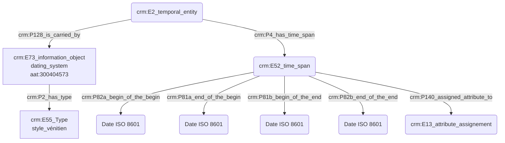

# Expression d'une date initialement présentée dans un autre référentiel calendaire

## a. Besoins musicologiques

Les chercheurs spécialisés en musicologie historique naviguent entre un grand nombre de référentiels calendaires. Il convient de proposer une convention qui permette leur compréhension immédiate à travers leur modélisation en Cidoc-CRM, tout en permettant aux chercheurs de témoigner d'incertitudes mais aussi d'éclairer la méthodologie derrière la conversion des dates.

## b. Problématisation

De quelle manière exprimer de manière compréhensible une date originellement exprimée dans un référentiel calendaire ancien, ou peu commun ?

## c. Contextualisation technique

Les ateliers menés auprès de musicologues nous ont permis d'orienter les résultats vers une nécessaire uniformisation des dates au format ISO 8601. Le chercheur est responsable de la transposition d'un référentiel à l'autre, et peut, s'il le souhaite, faire part d'une incertitude par l'usage d'un E13 Attribute Assignement.

## d. Proposition CIDOC CRM 

