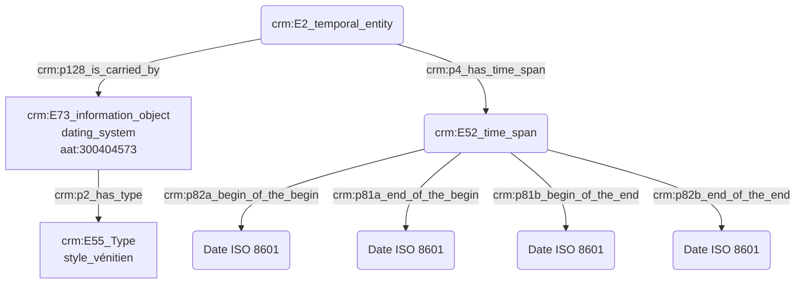

# Expression d'une date initialement présentée dans un autre référentiel calendaire

## a. Besoins musicologiques

## b. Problématisation

## c. Contextualisation technique

## d. Proposition Cidoc-CRM 

