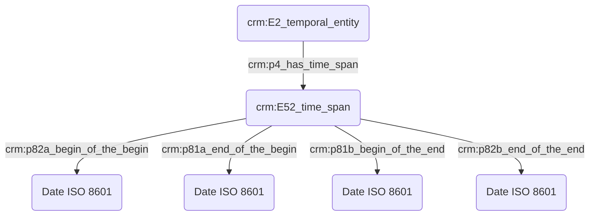

# Expression d'une date

## a. Besoins musicologiques

Le chercheur en sciences humaines doit pouvoir exprimer une incertitude avec souplesse, afin de transmettre avec justesse l'information scientifique, tout en étant conscient de la nécessité informatique d'une date précise exprimée dans un format référence.

Les implications de la définition du temps ont été clairement soulignés par la mise en exergue de divers cas particuliers complexes, voire douteux. Dans le cas de _L’Heure espagnole_ de Ravel, la partition chant et piano a été publiée en 1908 mais l'orchestration réalisée en 1910. La première interprétation publique de l’opéra a eu lieu en 1911, la même année que la publication de la partition pour orchestre. Ce cas souligne donc la possibilité de multiplier les champs "date" correspondant aux diverses versions de l'œuvre. 

## b. Problématisation

Toute date « souple » doit être flanquée d'un intervalle défini par deux dates calculables, définies par le chercheur, car il est le seul à savoir comment doit être raisonablement résolue une approximation comme « 3ème quart du 4ème siècle » (350—375 ? Autre chose ?). Les intervalles peuvent alors être définis de quatre manières principales :

## c. Contextualisation technique

Le terme _circa_ est par ailleurs régulièrement employé bien qu'il manque de précision à plusieurs égards. 

Si la possibilité d'exprimer le temps de manière souple est importante pour le chercheur en SHS, le fait qu'un événement ne dispose pas de date calculable par la machine (c'est-à-dire exprimable en ISO 8601) l'exclu de fait de toute représentation chronologique calculée des données.
En conséquence, il faudrait que toute date « souple » soit flanquée d'un intervalle défini par deux dates calculables.
Ces dates devraient pouvoir être définies par le chercheur, car il est le seul à savoir comment doit être raisonablement résolue une approximation comme *« 3ème quart du 4ème siècle »* (350—375 ? Autre chose ?). Les intervalles peuvent alors être définis de quatre manièr

Par ailleurs, une idée avancée durant la séance est que, du moins pour certaines disciplines, les chercheurs peuvent être amenés à favoriser le recours à des fourchettes floues afin de rester prudents si la définition des dates constituent un sujet de friction et de dissensus au sein de la communauté.

Comme évoqué *supra*, donner une date peut engager une prise de risque. Il faut ainsi des mécanismes de recueil des suggestions.

- Le système doit enregistrer chaque date soumise par les chercheurs comme des valeurs signées et datées. Le système ne doit ainsi pas considérer la valeur d'un champ date comme une donnée monolithique, mais comme un succession de contributions contextualisées, un peu à la manière d'un cahier de laboratoire.
- Quand la date n'apparaît pas dans la source, les dates saisies par les chercheurs sont des reconstructions argumentées, ce qui légitime encore davantage le mécanisme exposé juste *supra* qui permet de persister un faisceau d'indices.
- Chaque contribution doit offrir un champ permettant d'exprimer un degré de certitude. Un vocabulaire contrôlé proposant des paliers d'expression de la certitude doit être proposé, et partagé au sein du CM2.

## d. Proposition Cidoc-CRM

- Toute attribution de date repose sur une interprétation, aussi minime soit-elle, et est donc connectée au graphe par une instance de `crm:E13_Attribute_Assignment`.
- Le standard [ISO 8601](https://fr.wikipedia.org/wiki/ISO_8601) est retenu pour l'expression des dates dans les bases de données.
- Le chercheur est estimé spécialiste des calendriers non standards dans lesquels les dates dans ses sources sont exprimées.
- Le chercheur doit saisir ses dates en opérant une conversion en ISO 8601.
- Les systèmes informatiques doivent être délestés de la conversion des dates exprimées selon des calendriers non standards.
- La date constatée sur la source est reportée en annotation.

  - **Pour une personne :** une incertitude se présente pour une personne née la dernière décennie de février 1766, pouvant également être exprimé le 2?/02/1766. Idem pour une date présentant une incertitude plus ou moins toléré, comme un décès survenu le 7 ou 15/12/1654. Lors de l'usage du Cidoc CRM, plusieurs instances de E13 viendront justifier les choix de datation.

