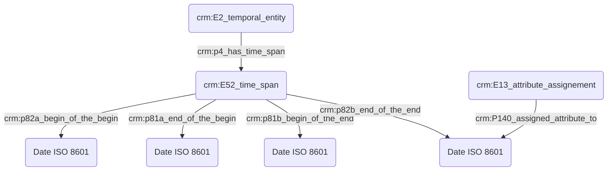

# Expression d'une incertitude

## a. Besoins musicologiques

Le chercheur en sciences humaines doit pouvoir exprimer une incertitude avec souplesse, afin de transmettre avec justesse l'information scientifique, tout en étant conscient de la nécessité informatique d'une date précise exprimée dans un format référence. Il faut ainsi fournir une méthode permettant l'expression de divers doutes, besoins, _etc_. Par exemple, dans les répertoires les plus anciens, l'exactitude des dates est souvent difficile à établir, voire contestée. Les propositions de datation doivent donc être argumentées et justifiées.

## b. Problématisation

Quels sont les outils permettant l'expression de l'incertitude entourant une datation en Cidoc-CRM ? On constate par exemple que le terme _circa_ est régulièrement employé, malgré son manque de précision ; il convient donc de trouver une solution pour exprimer le doute et les propositions de divers chercheurs.

## c. Contextualisation technique

Plusieurs instances de `crm:E13_Attribute_Assignment` viennent justifier les choix de datation, car toute attribution de date repose sur une interprétation, aussi minime soit-elle. Il convient ensuite au chercheur de se référer aux thésaurus et sources nécessaires afin de compléter sa proposition.

## d. Proposition CIDOC CRM

