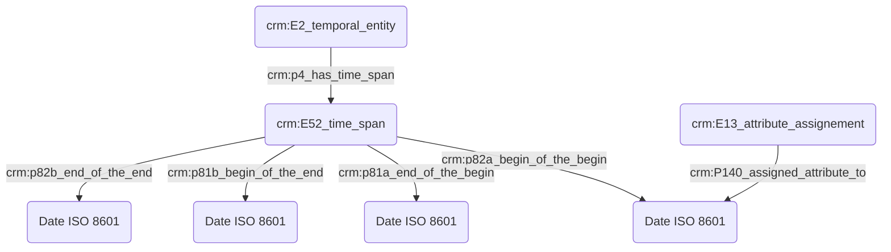

# Expression d'une incertitude

## a. Besoins musicologiques

Le chercheur en sciences humaines doit pouvoir exprimer une incertitude avec souplesse, afin de transmettre avec justesse l'information scientifique, tout en étant conscient de la nécessité informatique d'une date précise exprimée dans un format référence.

## b. Problématisation

## c. Contextualisation technique

## d. Proposition Cidoc-CRM

