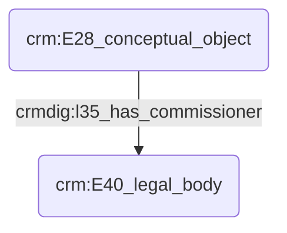

# Commanditaire d'une œuvre

## a. Besoins musicologiques

Nous avons besoin de modéliser la relation liant le commanditaire d'une œuvre et le compositeur, ainsi que la modélisation de l'œuvre elle-même pour modéliser l'influence du commanditaire sur celle-ci. 

## b. Problématisation

## c. Contextualisation technique

## d. Proposition Cidoc-CRM

