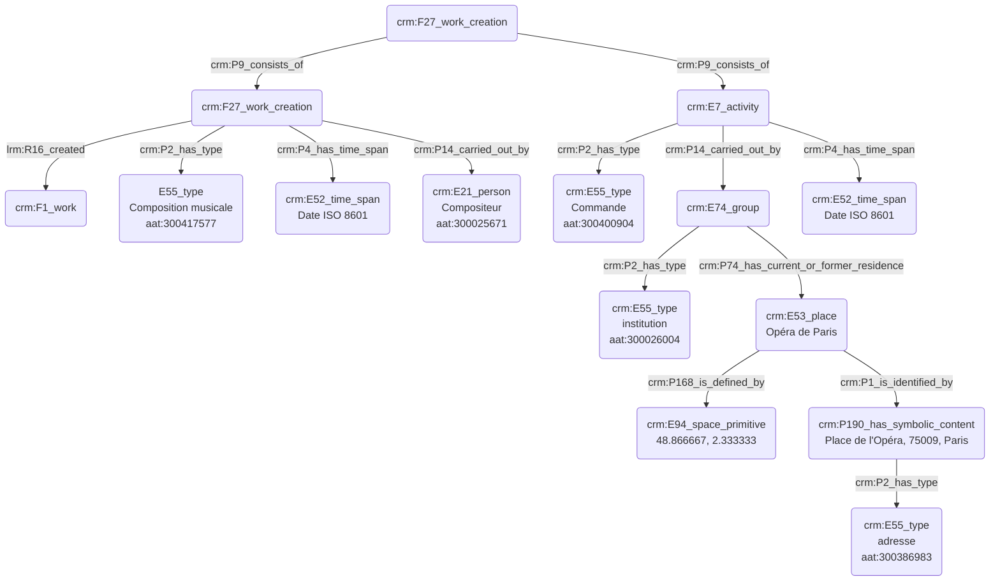

# Commanditaire d'une œuvre

## a. Besoins musicologiques

Nous avons besoin de modéliser la relation liant le commanditaire d'une œuvre au compositeur, ainsi que la pièce résultant de cette demande, le plus souvent caractérisée par une rétribution financière. Le commanditaire est souvent une personne morale (institution) plus qu'une personne physique ; nous nous attacherons néanmoins à expliciter ces deux possibilités distinctes. 

## b. Problématisation 
 
De quelle manière peut-on révéler l'aspect conséquentiel de l'œuvre suite à l'action du commanditaire et au passage de la commande ?

## c. Contextualisation technique

Le thesaurus Getty AAT nous permet de typer l'action de commande, tandis que l'institution est inscrite dans un champ spatio-temporel, étant le plus souvent reliée à un lieu bien précis, dans notre exemple l'Opéra de Paris. La date de commande de l'œuvre est ainsi indiquée, ainsi que sa date de finalisation (date de rendu de la partition au commanditaire). 

## d. Proposition Cidoc-CRM

