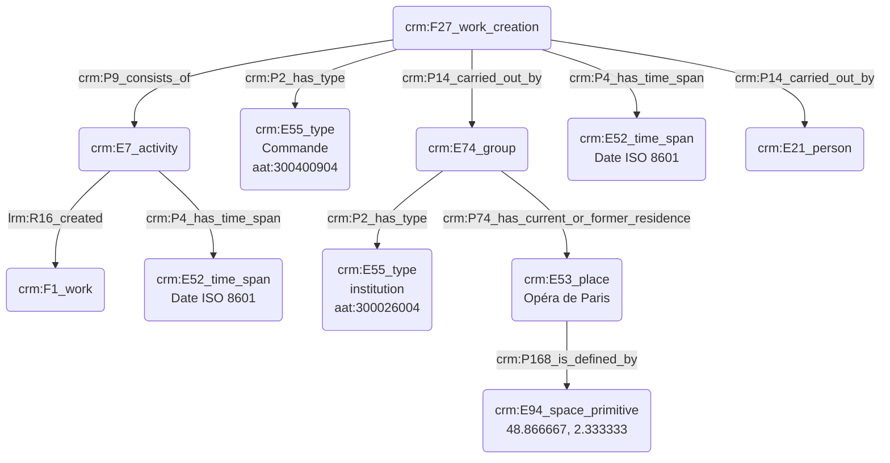

# Commanditaire d'une œuvre

## a. Besoins musicologiques

Nous avons besoin de modéliser la relation liant le commanditaire d'une œuvre au compositeur, ainsi que la pièce résultant de cette collaboration. Le commanditaire est souvent une personne morale (institution) plus qu'une personne physique ; nous nous attacherons néanmoins à expliciter ces deux possibilités distinctes. 

## b. Problématisation 

De quelle manière peut-on révéler l'aspect conséquentiel de l'œuvre suite à l'action de la commande ? Comment modéliser les différents types de commanditaires : institutionnels ou bien plus informels, commande d'une personne à une autre ?

## c. Contextualisation technique

Le thesaurus Getty AAT nous permet de typer l'action de commande, tandis que l'institution est inscrite dans un champ spatio-temporel. La date de commande de l'œuvre est ainsi, ainsi que sa date de finalisation. 

## d. Proposition Cidoc-CRM

