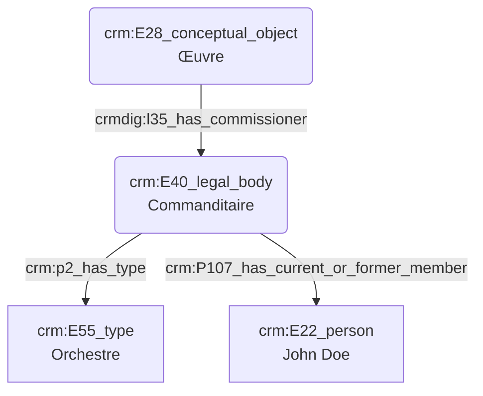

# Commanditaire d'une œuvre

## a. Besoins musicologiques

Nous avons besoin de modéliser la relation liant le commanditaire d'une œuvre et le compositeur, ainsi que la modélisation de l'œuvre elle-même pour modéliser l'influence du commanditaire sur celle-ci. 

## b. Problématisation 

## c. Contextualisation technique

## d. Proposition Cidoc-CRM

A(crm:F27_work_creation) --> |lrm:R16_created| B(crm:F1)
Va contenir un sous F27 "commande" relié au 1er F27 par un P9
On type le 2nd F27 (E55 commande avec le getty) et il n'y a plus d'E40, un P14 lie le 2nd F27 à un E74 "institution"
