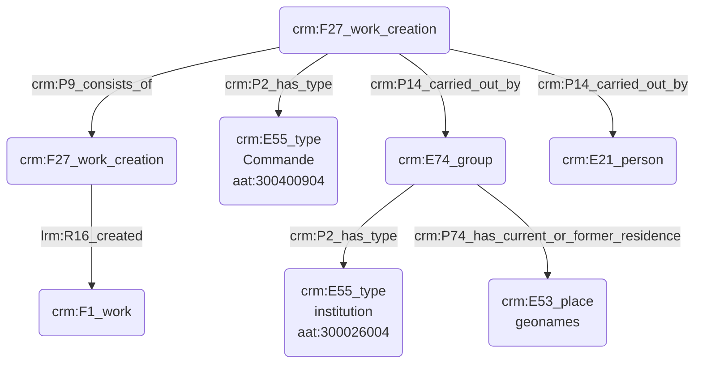

# Commanditaire d'une œuvre

## a. Besoins musicologiques

Nous avons besoin de modéliser la relation liant le commanditaire d'une œuvre au compositeur, ainsi que la pièce résultant de cette collaboration. Le commanditaire est souvent une personne morale (institution) plus qu'une personne physique.

## b. Problématisation 

## c. Contextualisation technique

## d. Proposition Cidoc-CRM

