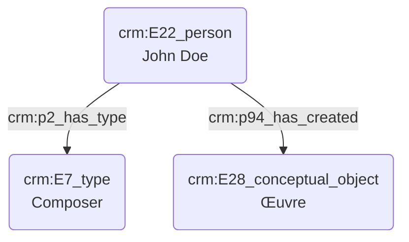

# Dédicataire d'une œuvre

## a. Besoins musicologiques

La dédicace d'une œuvre musicale diffère de la commande dans la mesure où n'elle n'induit aucun soutien financier, à moins que commanditaire et dédicataire soient la même personne. Le dédicataire peut-être un proche du compositeur, mais aussi une figure publique ; il peut s'agir d'un témoignage d'affection mais aussi d'admiration.

## b. Problématisation

## c. Contextualisation technique

## d. Proposition Cidoc-CRM

C(crm:E28_conceptual_object Œuvre) --> |crmdig:l35_has_commissioner| B(crm:E40_legal_body Commanditaire)
B(crm:E40_legal_body Commanditaire) --> |crm:p2_has_type| C[crm:E55_type Orchestre]
B(crm:E40_legal_body Commanditaire) --> |crm:P107_has_current_or_former_member| D[crm:E22_person John Doe]
