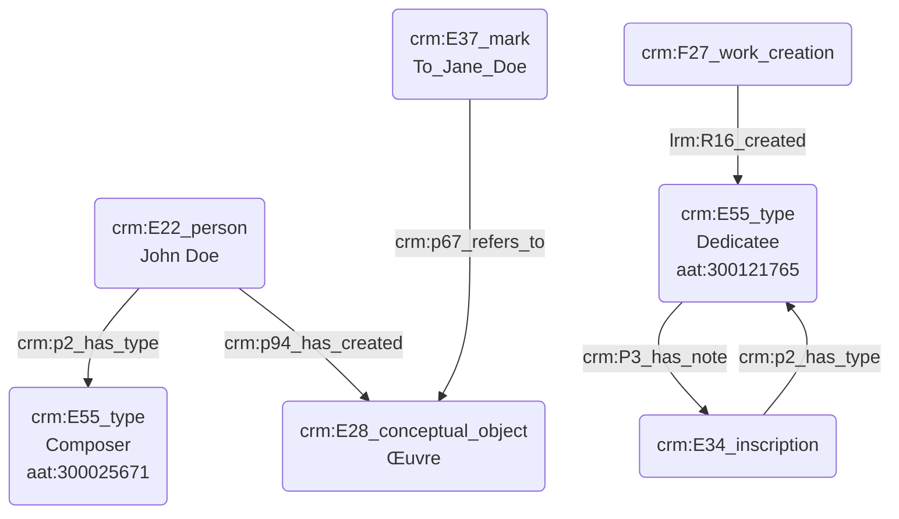

# Dédicataire d'une œuvre

## a. Besoins musicologiques

La dédicace d'une œuvre musicale diffère de la commande dans la mesure où n'elle n'induit aucun soutien financier, à moins que commanditaire et dédicataire soient la même personne. Le dédicataire peut-être un proche du compositeur, mais aussi une figure publique ; il peut s'agir d'un témoignage d'affection mais aussi d'admiration.

## b. Problématisation

Comment exprimer la dédicace, mention textuelle présente au sein de la partition ? Il s'agira également de distinguer clairement cette notion de la commande en marquant la différence entre l'aspect institutionnel de la commande et l'aspect plus personnel de la dédicace.

## c. Contextualisation technique

Nous ferons de nouveau appel au thesauras Getty Aat afin de typer les différents éléments du graphe Cidoc-CRM.

## d. Proposition Cidoc-CRM

