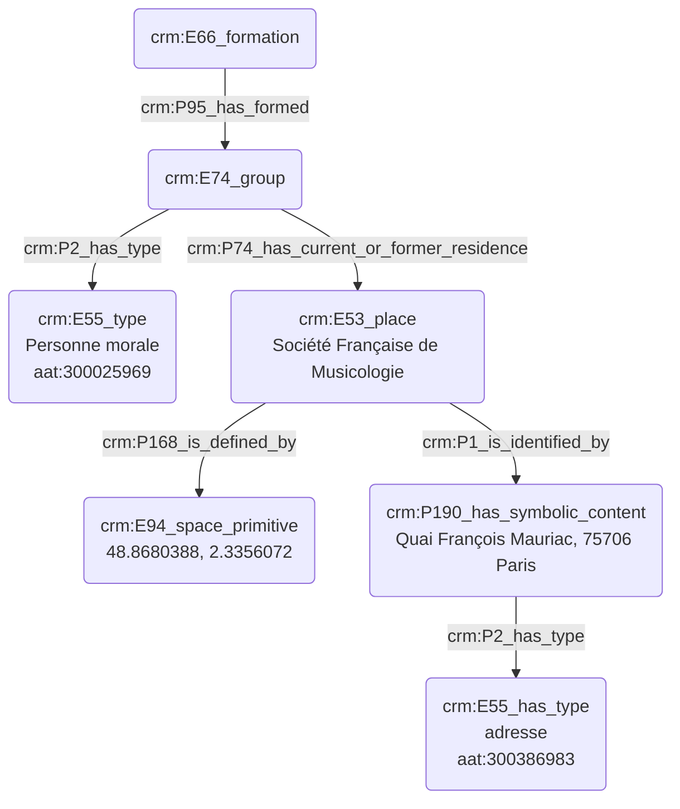

# Désignation d'une personne morale

## a. Besoins musicologiques

Une personne morale est, par définition, une entité regroupant divers individus regroupés sous un statut juridique, œuvrant de manière commune. Afin d'indexer une personne morale, il convient de signaler plusieurs éléments majeurs : les différentes personnes le composant, le statut juridique, la date de création de l'entité, le lieu éventuel où son bureau est établi, _etc._

## b. Problématisation

De quelle manière peut-on indiquer les caractéristiques principales d'une personne morale et les modéliser ?

## c. Contextualisation technique

## d. Proposition Cidoc-CRM

