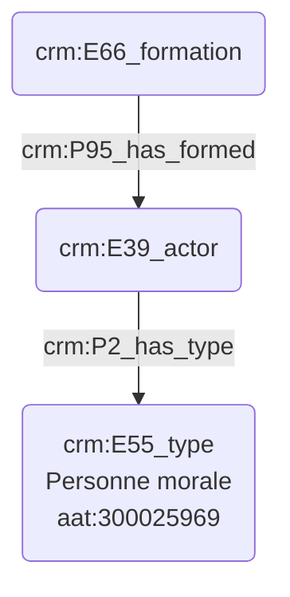

# Désignation d'une personne morale

## a. Besoins musicologiques

## b. Problématisation

## c. Contextualisation technique

## d. Proposition Cidoc-CRM

```mermaid
graph TD;

A(crm:E39_actor) --> |crm:P2_has_type| B(crm:E55_type<br>Personne morale<br>aat:300025969)
C(crm:E66_formation) --> |crm:P95_has_formed| A(crm:E39_actor)

```
