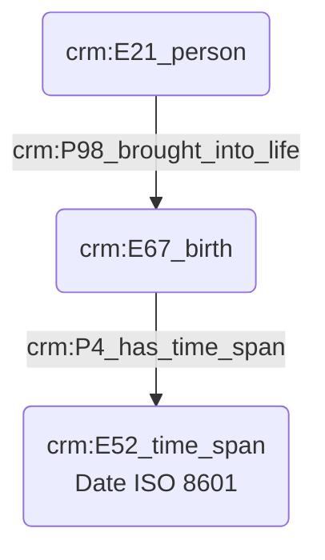

# Indexation d'une personne

## a. Besoins musicologiques

## b. Problématisation

## c. Contextualisation technique

## d. Proposition Cidoc-CRM

```mermaid
graph TD;

A(crm:E21_person) --> |crm:P98_brought_into_life| B(crm:E67_birth)
B(crm:E67_birth) --> |crm:P4_has_time_span| C(crm:E52_time_span<br>Date ISO 8601)


```
