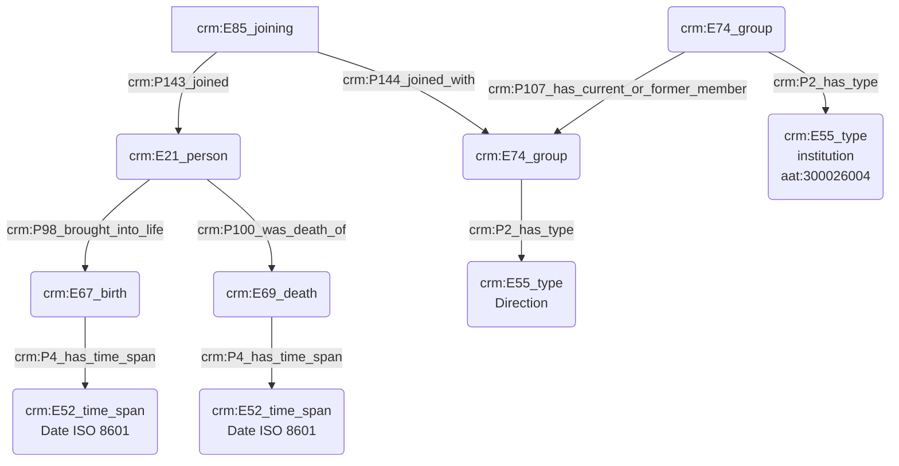
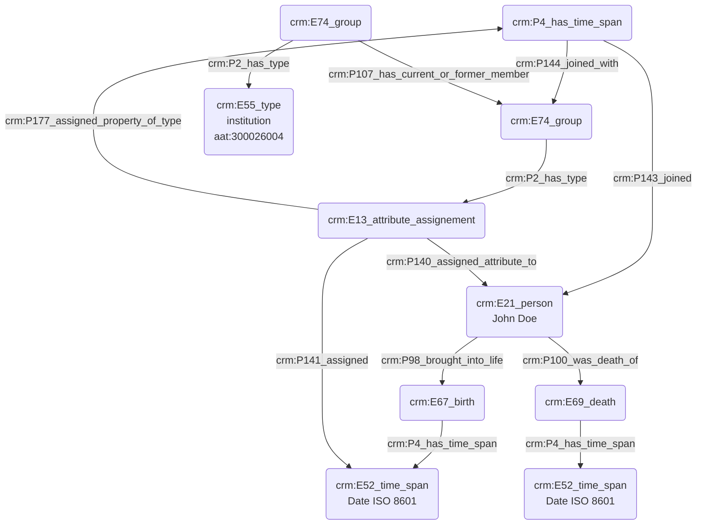

# Description d'une personne

## a. Besoins musicologiques

**_éléments pour la description d'une personne_**

Afin d'indexer une personne, nous avons dans un premier temps besoin d'informations biographiques basiques liées aux dates de naissance et de mort de l'individu. Nous pourrons, le cas échéant, exprimer de manière idoine aux exemples présents au sein du module _datation_ diverses incertitudes où des inscriptions dans des référentiels calendaires plus rares. La fonction et/ou le statut occupé par la personne sont également des éléments nous permettant d'indexer. 

## b. Problématisation

## c. Contextualisation technique

## d. Proposition Cidoc-CRM

