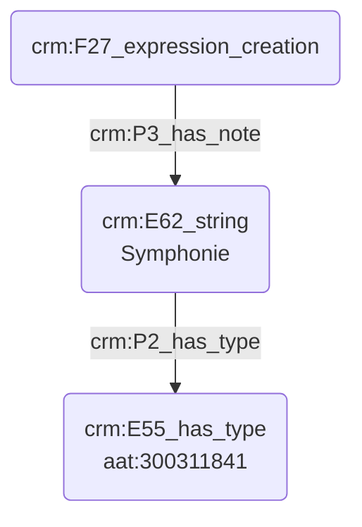

# Indexation d'une source avec un mot-clé

## a. Besoins musicologiques

## b. Problématisation

## c. Contextualisation technique

## d. Proposition Cidoc-CRM

```mermaid
graph TD;

A(crm:F27_expression_creation) --> |crm:P3_has_note| B(crm:E62_string<br>Symphonie)
B(crm:E62_string<br>Symphonie) --> |crm:P2_has_type| C(crm:E55_has_type<br>aat:300311841)

```
