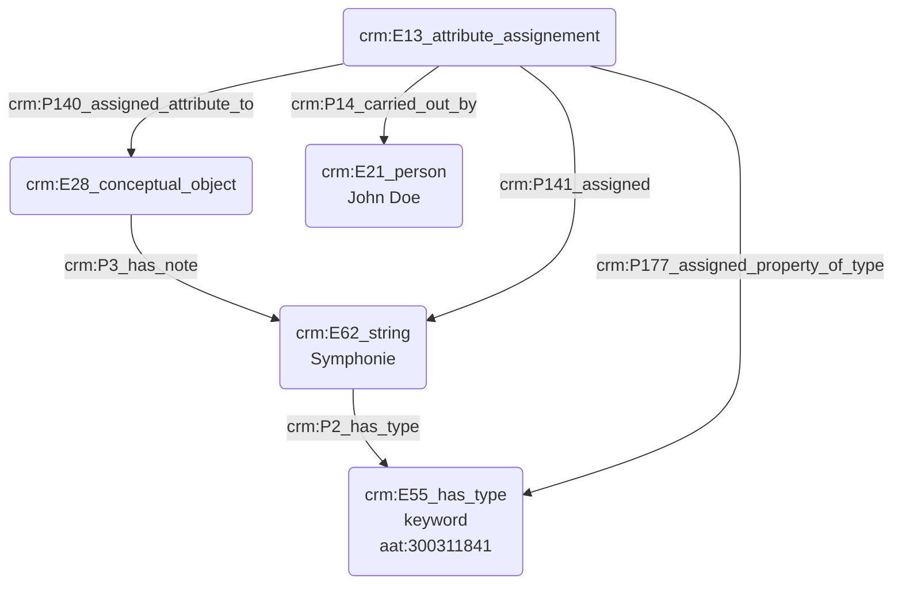

# Indexation d'une source avec un mot-clé

## a. Besoins musicologiques

Les sources historiques musicologiques sont souvent identifiés à l'aide de critères spécialisés liés à des notions théoriques, esthétiques ou encore 

## b. Problématisation

## c. Contextualisation technique

## d. Proposition Cidoc-CRM

