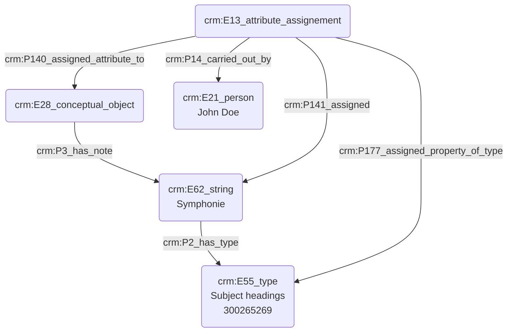

# Indexation d'une thématique

Les sources historiques musicologiques sont souvent identifiés à l'aide de critères spécialisés liés à des notions théoriques ou esthétiques, en plus des informations de temps et d'espace. Des mots-clés sont alors définis par la personne en charge de l'indexation et appliqués à différentes sources afin de les typer. Il est donc nécessaire de pouvoir modéliser l'indexation d'une source à l'aide d'un mot clé issu d'un thésaurus.

## b. Problématisation

De quelle manière peut-on indexer une source à l'aide d'un mot-clé ?

## c. Contextualisation technique

Nous utilisons ici le 'E13_attribute_assignement' afin d'attribuer un mot clé à une source. Le concept de "mot-clé" porté par un 'E62_string' est lui-même typé à l'aide du Getty AAT, tandis que les mots-clés eux-mêmes sont piochés au sein de ce thésaurus.

Nous faisons usage du terme _Subject headings_, issu du Getty AAT. Celui-ci permet d'exprimer des thématiques complexes, puisqu'il "combine ensemble plusieurs concepts uniques en une seule séquence de mots". 

## d. Proposition Cidoc-CRM

