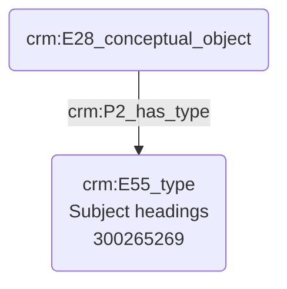

# Indexation d'une thématique

## a. Besoins musicologiques

## b. Problématisation

## c. Contextualisation technique

## d. Proposition Cidoc-CRM

```mermaid
graph TD;

A(crm:E28_conceptual_object) --> |crm:P2_has_type| B(crm:E55_type<br>Subject headings<br>300265269)

```
