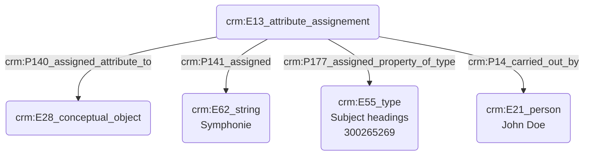

# Indexation d'une thématique

Au-delà des mots-clés abordés ci-avant, les sources historiques musicologiques sont souvent identifiés à l'aide de critères thématiques. Ce cas examine la modélisation de l'indexation d'une source à l'aide d'une thématique issue d'un thésaurus.

## b. Problématisation

De quelle manière peut-on indexer une source à l'aide d'ue thématique ?

## c. Contextualisation technique

Nous utilisons ici le 'E13_attribute_assignement' afin d'attribuer une thématique à une source. Nous faisons usage du terme _Subject headings_, issu du Getty AAT. Celui-ci permet d'exprimer des thématiques complexes, puisqu'il "combine ensemble plusieurs concepts uniques en une seule séquence de mots". Les thématiques, portées par un 'E62_string' sont également tirées du Getty AAT.

## d. Proposition Cidoc-CRM

