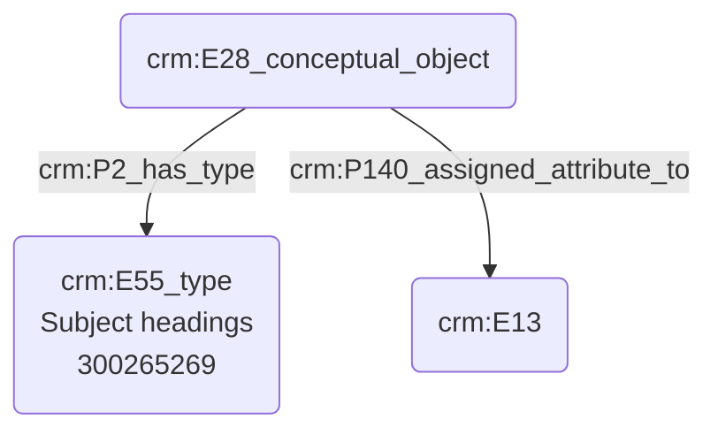

# Indexation d'une thématique

## a. Besoins musicologiques

## b. Problématisation

## c. Contextualisation technique

Nous faisons usage du terme _Subject headings_, issu du Getty AAT. Celui-ci permet d'exprimer des thématiques complexes, puisqu'il "combine ensemble plusieurs concepts uniques en une seule séquence de mots". 

## d. Proposition Cidoc-CRM

