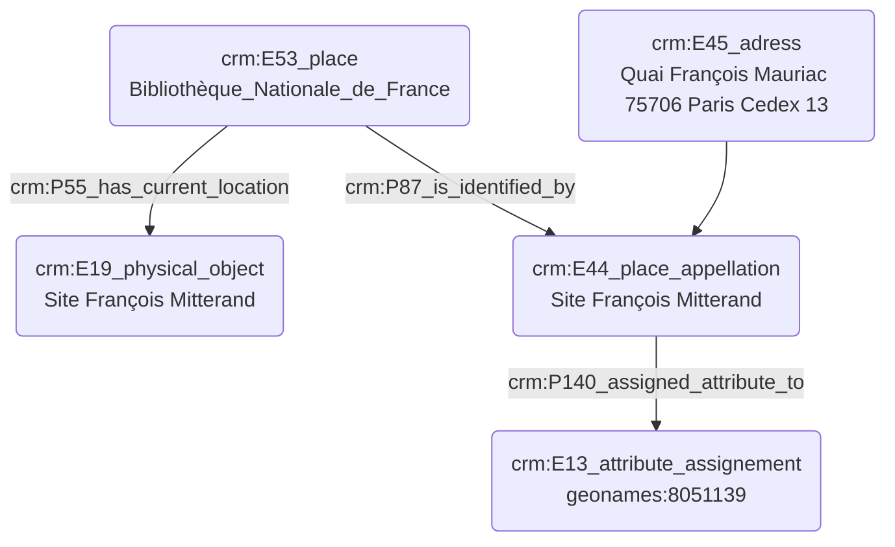

# Indexation d'un lieu

## a. Besoins musicologiques

## b. Problématisation 

## c. Contextualisation technique

## d. Proposition Cidoc-CRM

```mermaid
graph TD;

A(crm:E53_place<br>Bibliothèque_Nationale_de_France) --> |crm:P55_has_current_location| B(crm:E19_physical_object<br>Site François Mitterand)
A(crm:E53_place<br>Bibliothèque_Nationale_de_France) --> |crm:P87_is_identified_by| C(crm:E44_place_appellation<br>Site François Mitterand)
D(crm:E45_adress<br>Quai François Mauriac 75706 Paris Cedex 13) --> C(crm:E44_place_appellation<br>Site François Mitterand)
C(crm:E44_place_appellation<br>Site François Mitterand) --> |crm:P140_assigned_attribute_to| E(crm:E13_attribute_assignement<br>geonames:8051139)

```

