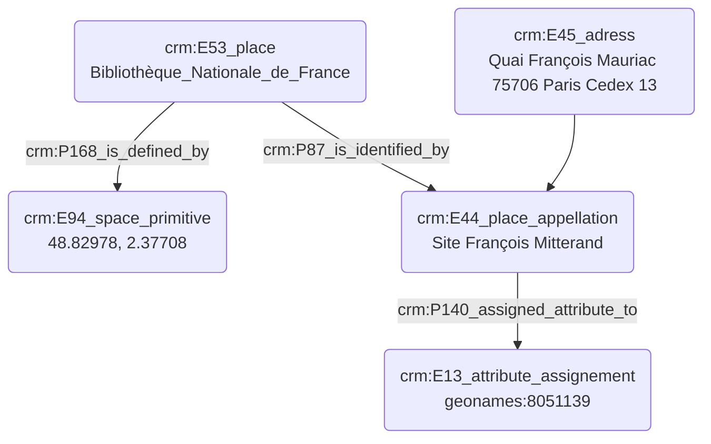

# Indexation d'un lieu

## a. Besoins musicologiques

## b. Problématisation 

## c. Contextualisation technique

Quels sont les critères d'indexation nécessaires pour identifier un lieu ? 

## d. Proposition Cidoc-CRM

Faire un E74 connecté à un E53 avec un P74 et pas besoin de E13 / représenter le fait qu'une institution a plusieurs lieux
E44 et E45 n'existent plus, l'adresse P1 --> E41 adresse postale

E74 BNF / E53 le site Tolbiac P1 --> E41 --> P190 ("3 rue blablabla")
                                         --> P2 --> E55 --> P1 ("adresse")
