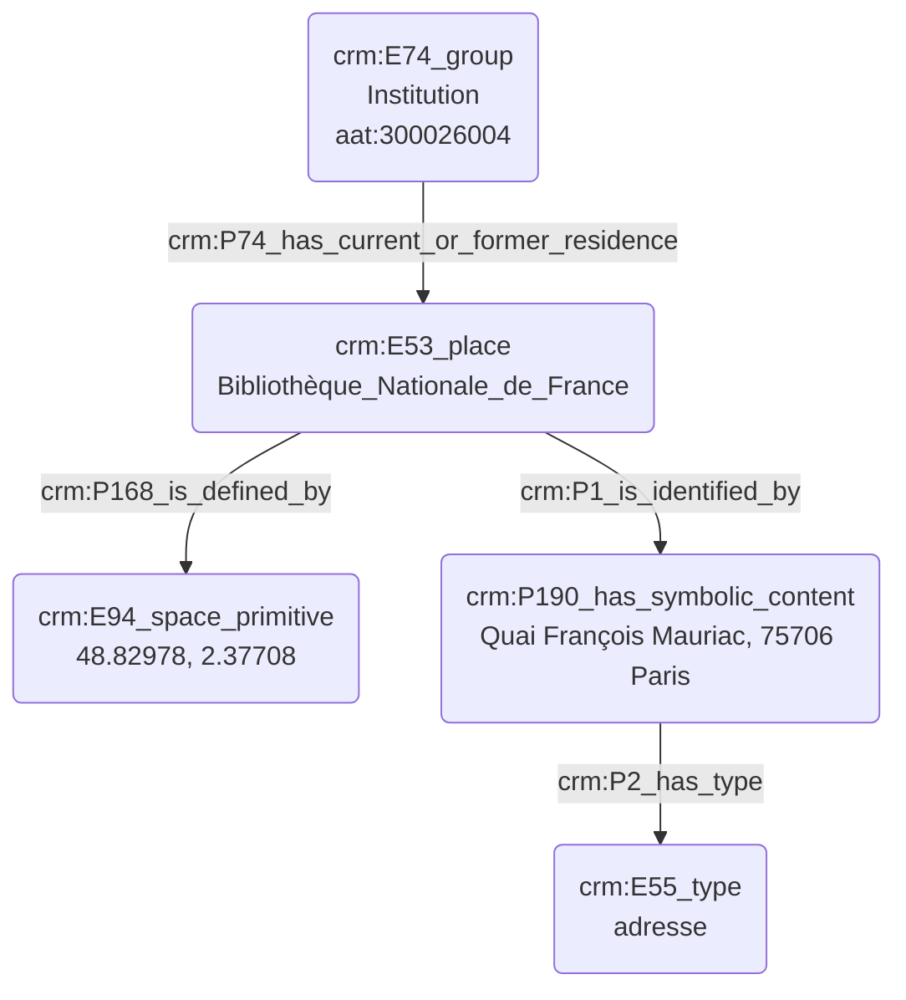

# Indexation d'un lieu

## a. Besoins musicologiques

## b. Problématisation 

## c. Contextualisation technique

Quels sont les critères d'indexation nécessaires pour identifier un lieu ? Utiliser le E53 ou le E74 comme critère d'indexation

## d. Proposition Cidoc-CRM

