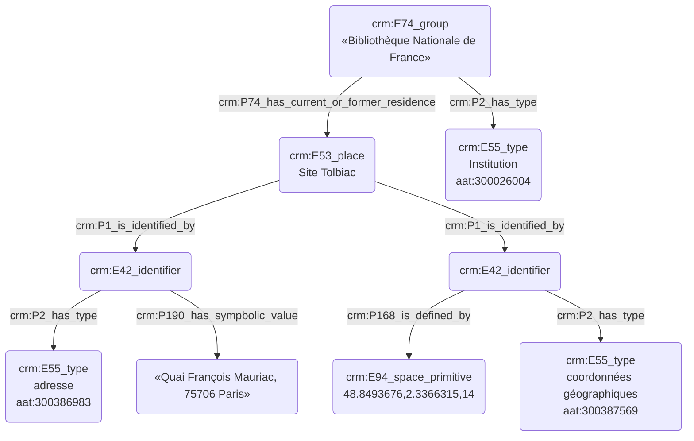

# Indexation d'un lieu 

## a. Besoins musicologiques

Lors du processus d'indexation conceptuelle, il est nécessaire de distinguer les lieux à l'aide de divers critères remarquables, tout en prenant soin - si besoin est - de relier chaque lieu à l'institution qu'il incarne. Il est également important de fournir des coordonnées GPS afin de pouvoir saisir la position géographique réelle du lieu. 

## b. Problématisation 

Comment modéliser un lieu tout en faisant apparaître l'institution à laquelle il se rattache, mais aussi son adresse, voire ses différentes adresses ?

## c. Contextualisation technique

Afin d'exprimer les coordonnées géographiques en Cidoc-CRM, l'usage de l'entité E94_space_primitive est conseillé, directement complété par l'indication des données GPS. Le thésaurus Getty AAT est utilisé pour identifier le concept d'institution.

## d. Proposition Cidoc-CRM

