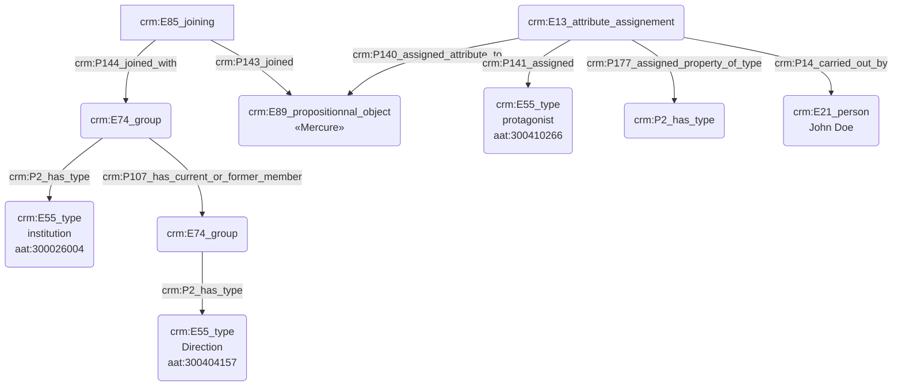

# Statut et fonction d'une personne fictive

## a. Besoins musicologiques

## b. Problématisation

## c. Contextualisation technique

Nous avons fait le choix d'exprimer la fonction d'une personne par l'usage de deux 'E74_group' ; le premier d'entre eux correspond à la structure qui accueille la personne et le second, inclus dans le premier, détaille la fonction occupée. Il est posssible de raffiner encore plus le processus par l'usage de 'E74_group' supplémentaires, jusqu'à arriver au niveau de précision attendu.

## d. Proposition Cidoc-CRM

