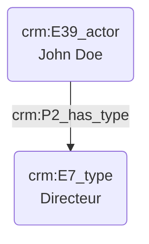

# Statut et fonction d'une personne réelle

## a. Besoins musicologiques

## b. Problématisation

## c. Contextualisation technique

## d. Proposition Cidoc-CRM

```mermaid
graph TD;

B(crm:E39_actor<br>John Doe) -->|crm:P2_has_type| C(crm:E7_type<br>Directeur)

```

