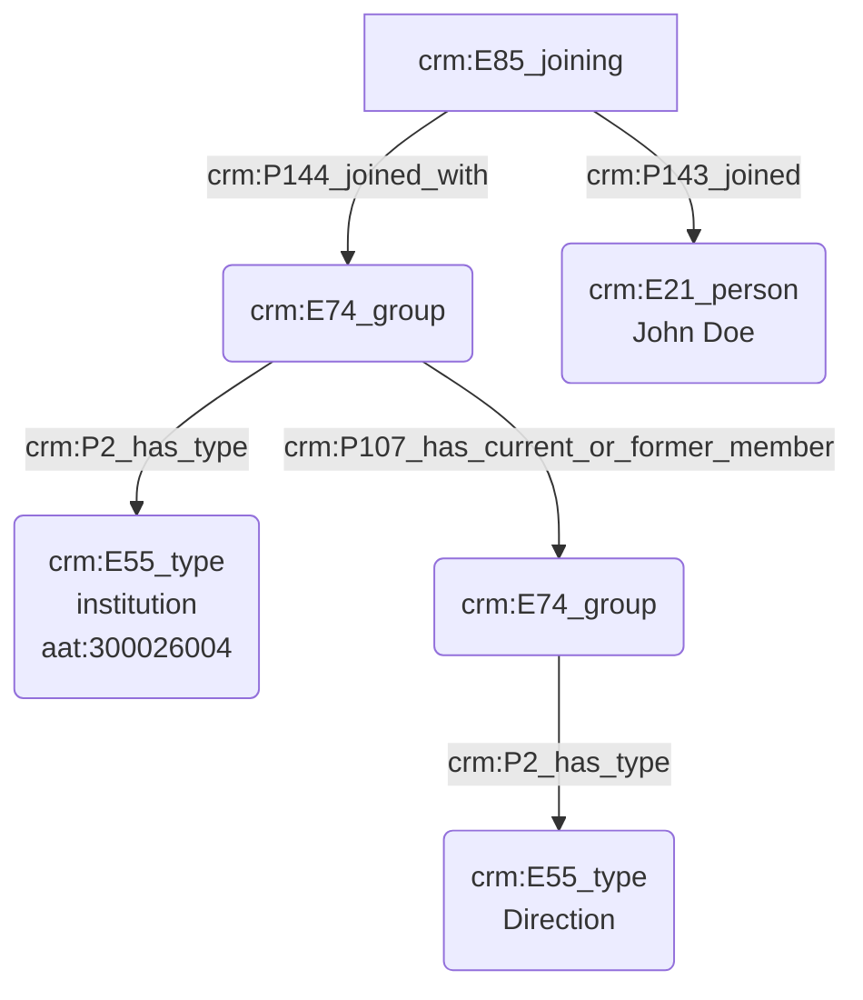

# Statut et fonction d'une personne réelle

## a. Besoins musicologiques

## b. Problématisation

## c. Contextualisation technique

Nous présentons ici le protocole permettant de préciser le statut et/ou la fonction d'une personne au sein d'une institution. Nousavons fait le choix d'exprimer la fonction d'une personne par l'usage de deux 'E74_group' ; le premier d'entre eux correspond à la structure qui accueille la personne et le second, inclus dans le premier, détaille la fonction occupée. Il est posssible de raffiner encore plus le processus par l'usage de 'E74_group' supplémentaires, jusqu'à arriver au niveau de précision attendu. Les concepts adjacents aux 'E74_group' sont typés à l'aide du Getty AAT pour assurer une interopérabilité maximale.

## d. Proposition Cidoc-CRM

