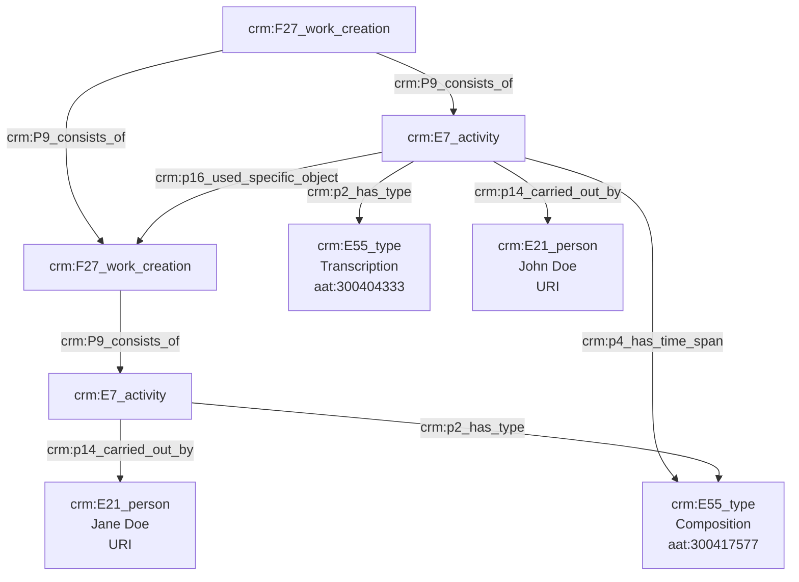

# Transcription d'une œuvre

## a. Besoins musicologiques

L'acte de transcription musicale implique un certain nombre d'entités qu'il convient d'identifier avec précision dans le cadre de l'indexation conceptuelle : œuvre originelle, œuvre transcrite, compositeur et transcripteur, dans l'éventualité où les deux tâches seraient accomplies par des personnes différentes.

## b. Problématisation

De quelle manière peut-on exprimer l'action de transcription d'une œuvre existante ? 

## c. Contextualisation technique

Le compositeur et le transcripteur doivent être clairement nommés et identifiés, si possible à l'aide d'une URI, et les activités de transcription et de composition sont typées à l'aide du Thésaurus Getty AAT. Nous datons également l'action de transcription. 

## d. Proposition Cidoc-CRM

