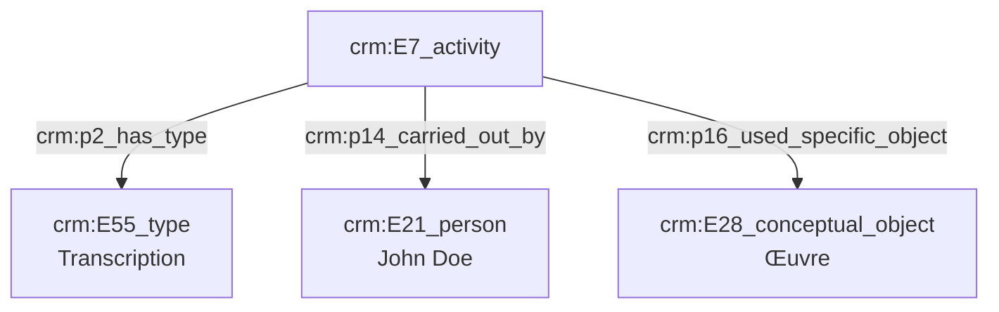

# Transcription d'une œuvre

## a. Besoins musicologiques

## b. Problématisation

## c. Contextualisation technique

## d. Proposition Cidoc-CRM

```mermaid
graph TD;

A[crm:E7_activity] --> |crm:p2_has_type| B[crm:E55_type<br>Transcription]
A[crm:E7_activity] --> |crm:p14_carried_out_by| C[crm:E21_person<br>John Doe]
A[crm:E7_activity] --> |crm:p16_used_specific_object| D[crm:E28_conceptual_object<br>Œuvre]

```

