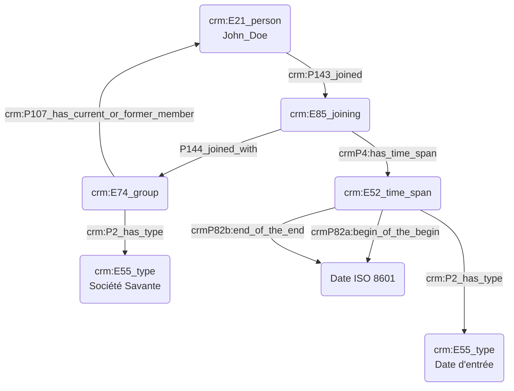

# Appartenance à un groupe social

## a. Besoins musicologiques

L'appartenance à un groupe - qu'il soit publiquement identifié (société savante) - ou bien lié à l'association de diverses personnalités (par exemple, le "Groupe des six") permet de reconstituer des liens inter-personnels dans l'optique d'un travail de recherche musicologique. Nous pouvons ainsi témoigner d'une certaine influence esthétique chez une personne liée à la fréquentation d'un cercle promeuvant une certaine idéologie, _etc_.

## b. Problématisation

## c. Contextualisation technique

## d. Proposition Cidoc-CRM

