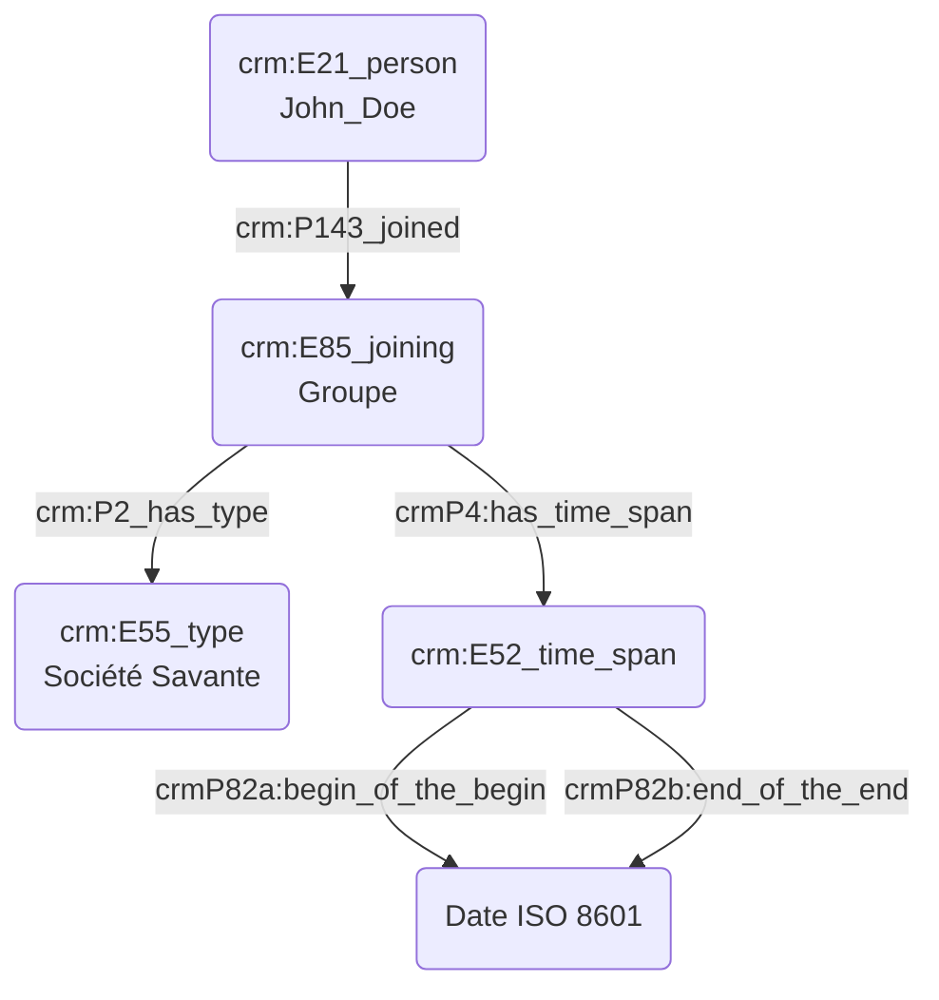

# Appartenance à un groupe social

## a. Besoins musicologiques

## b. Problématisation

## c. Contextualisation technique

## d. Proposition Cidoc-CRM

```mermaid
graph TD;

A(crm:E21_person<br>John_Doe) -->|crm:P143_joined| B(crm:E85_joining<br>Groupe)
B(crm:E85_joining<br>Groupe) -->|crm:P2_has_type| C(crm:E55_type<br>Société Savante)
B(crm:E85_joining<br>Groupe) --> |crmP4:has_time_span| D(crm:E52_time_span)
D(crm:E52_time_span) --> |crmP82a:begin_of_the_begin| E(Date ISO 8601)
D(crm:E52_time_span) --> |crmP82b:end_of_the_end| E(Date ISO 8601)


```
