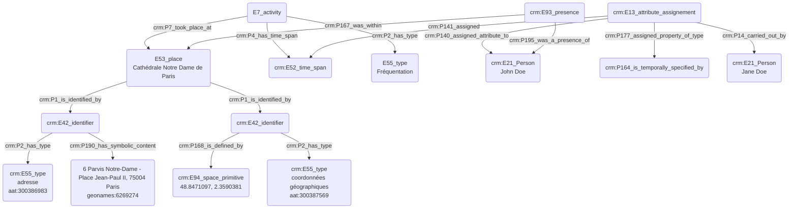

# Fréquentation d'un lieu à un instant donné

## a. Besoins musicologiques

Les chercheurs ont besoin de témoigner de manière normée de la présence d'une ou plusieurs personnes au sein d'un espace-temps normé, avec une date précise exprimée dans un format référence.

## b. Problématisation

Comment peut-on exprimer la présence d'une personne physique dans un lieu donné, au sein d'une période de temps définie par le chercheur ? Nous ne nous posons pas encore la question des outils de modélisation pour la définition de la personne dans le cadre de cet exemple, mais son rôle et son statut peuvent être précisés.

## c. Contextualisation technique

L'utilisation de deux intervalles est primordiale pour exprimer une incertitude sur la temporalité de la présence dans un lieu donné. Celle-ci peut être enrichie d'une annotation, tout comme des commentaires liés à l'attribution de l'endroit fréquenté.

## d. Proposition Cidoc-CRM

