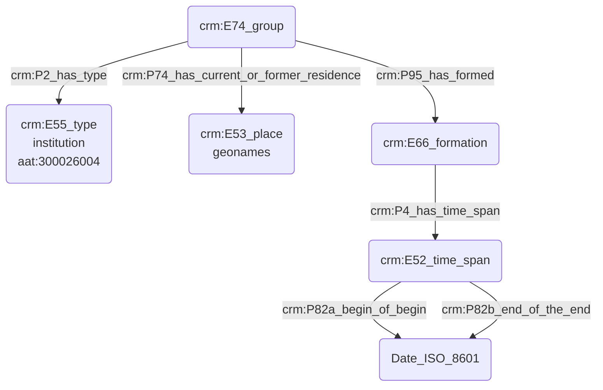

# Modélisation d'une institution

## a. Besoins musicologiques

De toutes époques, les institutions sont au cœur de la vie musicale. Elles peuvent tout autant accueillir des concerts que passer commande aux compositeurs, tout en insufflant des directives artistiques. Il est alors nécessaire de pouvoir les modéliser dans toute leur complexité, en indiquant leurs coordonnées géographiques - dépendent-elles d'un lieu bien spécifique ? -, la date de leur création ou bien l'arrivée d'une nouvelle direction, _etc_... 

## b. Problématisation

Comment représenter l'existence d'une institution, son domaine de rattachement mais aussi des données plus empiriques telles que le lieu où elle est établie, sa date de création,_etc_ ?

## c. Contextualisation technique

Le thésaurus Getty AAT permet de caractériser la typologie "institution" à l'aide d'un vocabulaire contrôlé, dont la définition est la suivante : "[nous traduisons] Organisations, associations ou établissements formellement structurés afin de promouvoir un objectif public ou privé spécifique, généralement un objectif religieux, caritatif ou éducatif." En partant de ce postulat, nous exprimons ensuite les caractéristiques principales de l'institution : lieu où elle se trouve, date de création, _etc_.

## d. Proposition Cidoc-CRM

