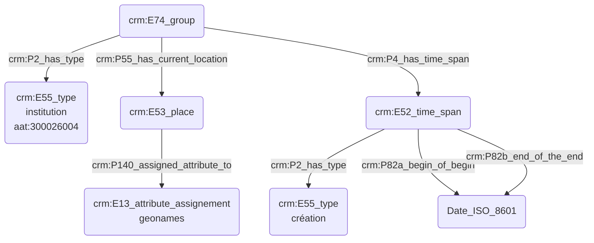

# Modélisation d'une institution

## a. Besoins musicologiques

De toutes époques, les institutions sont au cœur de la vie musicale. Elles peuvent tout autant accueillir des concerts que passer commande aux compositeurs, tout en insufflant des directives artistiques. Il est alors nécessaire de pouvoir les modéliser dans toute leur complexité, en indiquant leurs coordonnées géographiques - dépendent-elles d'un lieu bien spécifique ? -, la date de leur création ou bien l'arrivée d'une nouvelle direction, etc... 

## b. Problématisation

## c. Contextualisation technique

## d. Proposition Cidoc-CRM

