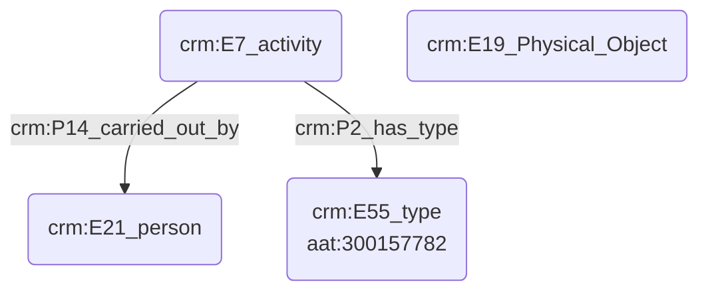
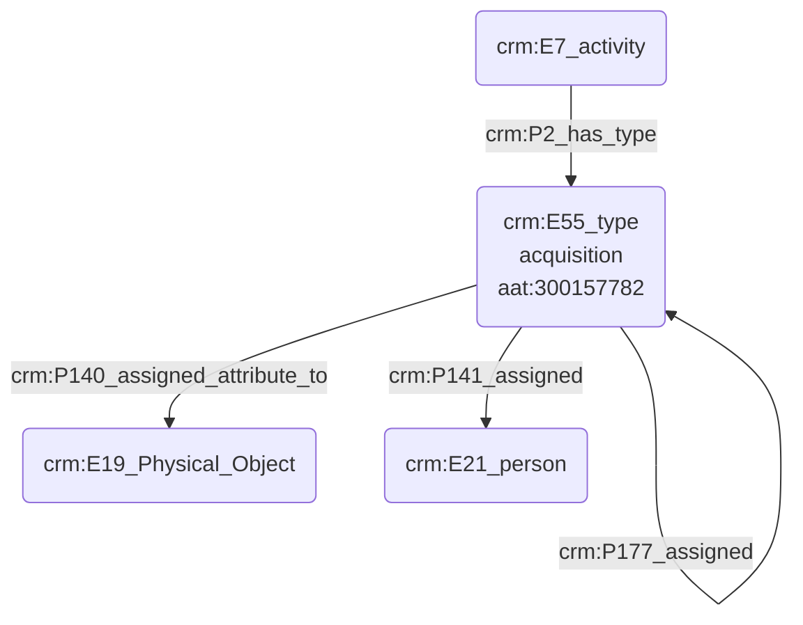

```mermaid
graph TD;

C(crm:E7_activity) -->|crm:P14_carried_out_by| A(crm:E21_person)
C(crm:E7_activity) -->|crm:P2_has_type| D(crm:E55_type<br>aat:300157782)
 B(crm:E19_Physical_Object)

```

```mermaid
graph TD;

E(crm:E13_attribute_assignement) --> |crm:P140_assigned_attribute_to| B(crm:E19_Physical_Object)
E(crm:E13_attribute_assignement) --> |crm:P141_assigned| A(crm:E21_person)
E(crm:E13_attribute_assignement) --> |crm:P177_assigned| E(crm:E55_type<br>acquisition<br>aat:300157782)

C(crm:E7_activity) -->|crm:P2_has_type| E(crm:E55_type<br>acquisition<br>aat:300157782)


```
