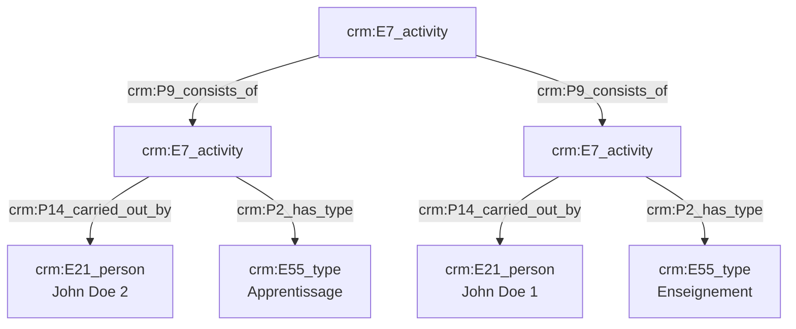

# Relation de maître à élève

## a. Besoins musicologiques

## b. Problématisation

## c. Contextualisation technique

## d. Proposition Cidoc-CRM

```mermaid
graph TD;

F[crm:E7_activity] --> |crm:P9_consists_of| D[crm:E7_activity]
F[crm:E7_activity] --> |crm:P9_consists_of| A[crm:E7_activity]

A[crm:E7_Activity] --> |crm:P14_carried_out_by| B[crm:E21_person<br>John Doe 1]
A[crm:E7_activity] --> |crm:P2_has_type| C[crm:E55_type<br>Enseignement]

D[crm:E7_Activity] --> |crm:P14_carried_out_by| E[crm:E21_person<br>John Doe 2]
D[crm:E7_activity] --> |crm:P2_has_type| G[crm:E55_type<br>Apprentissage]


```

