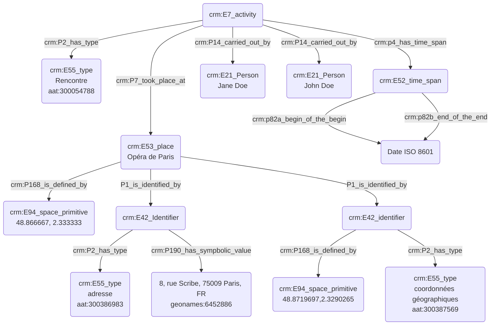

# rencontre de quelqu'un dans un lieu fréquenté par les deux personnes

## a. Besoins musicologiques

## b. Problématisation

## c. Contextualisation technique

## d. Proposition Cidoc-CRM

```mermaid
graph TD;

K(crm:E7_activity<br>rencontre) --->|crm:P7_took_place_at| M(crm:E53_place<br>Opéra de Paris)
M(crm:E53_place<br>Opéra de Paris) --> |crm:P168_is_defined_by| N(crm:E94_space_primitive
48.866667, 2.333333)
M(crm:E53_place<br>Opéra de Paris) --> |P1_is_identified_by| O(crm:E42_Identifier)
O(crm:E42_Identifier) --> |crm:P2_has_type| P(crm:E55_type<br>adresse<br>aat:300386983)
O(crm:E42_Identifier) --> |crm:P190_has_sympbolic_value| Q(8, rue Scribe, 75009 Paris, FR<br>geonames:6452886)
K(crm:E7_activity<br>recontre) --> |crm:P2_has_type| L(crm:E55_type<br>Rencontre<br>aat:300054788)
M(crm:E53_place<br>Opéra de Paris) --> |P1_is_identified_by| R(crm:E42_Identifier)
R(crm:E42_identifier) --> |crm:P168_is_defined_by| S(crm:E94_space_primitive<br>48.8719697,2.3290265)
R(crm:E42_identifier) --> |crm:P2_has_type| T(crm:E55_type<br>coordonnées géographiques<br>aat:300387569)
 
K(crm:E7_activity) --> |crm:p4_has_time_span| D(crm:E52_time_span)
D(crm:E52_time_span) --> |crm:p82a_begin_of_the_begin| E("Date ISO 8601")
D(crm:E52_time_span) --> |crm:p82b_end_of_the_end| E("Date ISO 8601")

K(crm:E7_activity) -->|crm:P14_carried_out_by| A(crm:E21_Person<br>Jane Doe)
K(crm:E7_activity) -->|crm:P14_carried_out_by| J(crm:E21_Person<br>John Doe)

```

