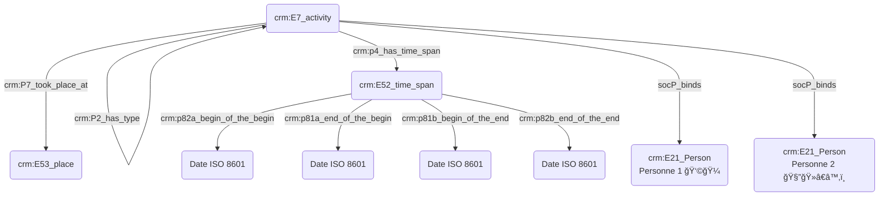

# rencontre de quelqu'un dans un lieu fréquenté par les deux personnes

## a. Besoins musicologiques

## b. Problématisation

## c. Contextualisation technique

## d. Proposition Cidoc-CRM

```mermaid
graph TD;

K(crm:E7_activity<br>rencontre) --->|crm:P7_took_place_at| I(crm:E53_place)
K(crm:E7_activity<br>recontre) --> |crm:P2_has_type| K(crm:E55_type<br>aat:300054788)
 
K(crm:E7_activity) --> |crm:p4_has_time_span| D(crm:E52_time_span)
D(crm:E52_time_span) --> |crm:p82a_begin_of_the_begin| E("Date ISO 8601")
D(crm:E52_time_span) --> |crm:p81a_end_of_the_begin| F("Date ISO 8601")
D(crm:E52_time_span) --> |crm:p81b_begin_of_the_end|G("Date ISO 8601")
D(crm:E52_time_span) --> |crm:p82b_end_of_the_end| H("Date ISO 8601")

K(crm:E7_activity) --->|socP_binds| A("crm:E21_Person<br>Personne 1 👩ğŸ¼")
K(crm:E7_activity) --->|socP_binds| J("crm:E21_Person<br>Personne 2 🧔ğŸ»â€â™‚ï¸")

```

