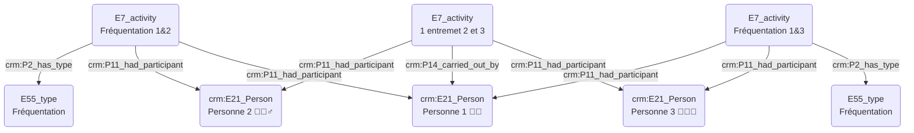
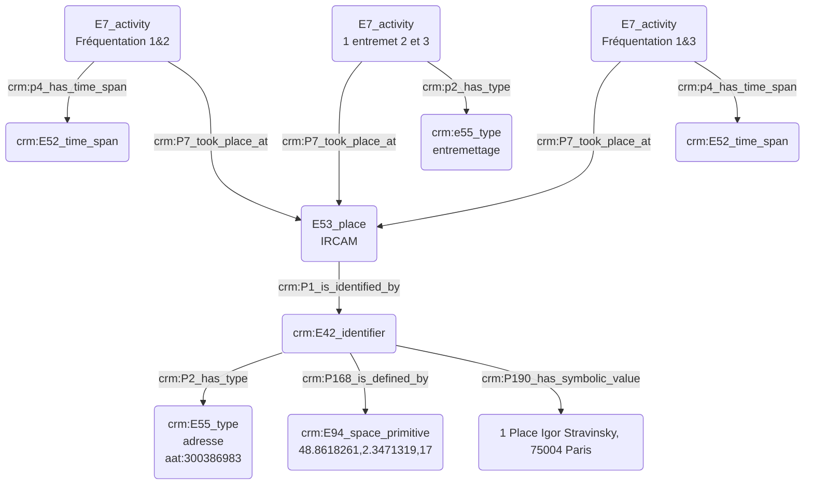

# Rencontre de quelqu'un par le biais d'une tierce personne au sein d'un même lieu

## a. Besoins musicologiques

## b. Problématisation

## c. Contextualisation technique

## d. Proposition Cidoc-CRM

### - Quelqu'un a rencontré quelqu'un par le biais d'une tierce personne au sein d'un même lieu :

